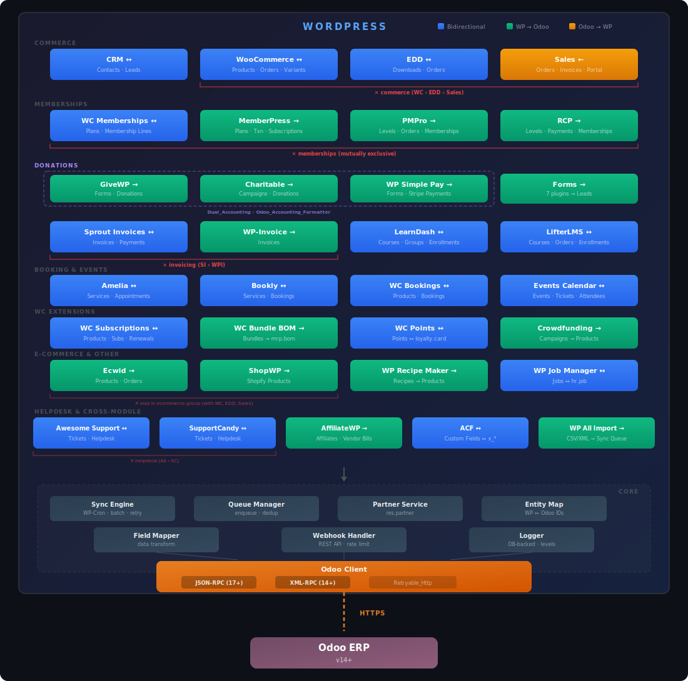

# Architecture — WordPress For Odoo

## Overview

Modular WordPress plugin providing bidirectional synchronization between WordPress/WooCommerce and Odoo ERP (v14+). The plugin covers 33 modules across 20 domains: CRM, Sales & Invoicing, WooCommerce, WooCommerce Subscriptions, WC Bundle BOM, WC Points & Rewards, Easy Digital Downloads, Memberships (WC Memberships + MemberPress + PMPro + RCP), Donations (GiveWP + WP Charitable + WP Simple Pay), Forms (7 plugins), WP Recipe Maker, LMS (LearnDash + LifterLMS), Booking (Amelia + Bookly), Events (The Events Calendar + Event Tickets), Invoicing (Sprout Invoices + WP-Invoice), E-Commerce (WP Crowdfunding + Ecwid + ShopWP), Helpdesk (Awesome Support + SupportCandy), HR (WP Job Manager), Affiliates (AffiliateWP), and Meta-modules (ACF + WP All Import).



## Directory Structure

```
WordPress For Odoo/
├── wp4odoo.php              # Entry point, singleton, autoloader, hooks, WP-CLI registration (~280 lines)
├── ARCHITECTURE.md                    # This file
├── CHANGELOG.md                       # Version history
├── package.json                       # npm config (@wordpress/env for integration tests)
├── .wp-env.json                       # wp-env Docker config (WordPress + WooCommerce)
├── phpunit-integration.xml            # PHPUnit config for integration test suite
│
├── includes/
│   ├── api/
│   │   ├── interface-transport.php         # Transport interface (authenticate, execute_kw, get_uid)
│   │   ├── class-odoo-transport-base.php  # Abstract base: shared properties, constructor, ensure_authenticated()
│   │   ├── trait-retryable-http.php       # Retryable_Http trait (single-attempt HTTP POST, fail-fast for queue-level retry)
│   │   ├── class-odoo-client.php          # High-level client (CRUD, search, fields_get, reset(), session re-auth on 403)
│   │   ├── class-odoo-jsonrpc.php         # JSON-RPC 2.0 transport (Odoo 17+) extends Odoo_Transport_Base
│   │   ├── class-odoo-xmlrpc.php          # XML-RPC transport (legacy) extends Odoo_Transport_Base
│   │   └── class-odoo-auth.php            # Auth, API key encryption (+ credential cache), connection testing
│   │
│   ├── modules/
│   │   ├── # ─── CRM ──────────────────────────────────────────
│   │   ├── trait-crm-user-hooks.php          # CRM: WP user hook callbacks (register, update, delete)
│   │   ├── class-crm-module.php              # CRM: contact sync orchestration (uses CRM_User_Hooks trait)
│   │   ├── class-contact-manager.php         # CRM: contact data load/save/sync-check
│   │   ├── class-lead-manager.php            # CRM: lead CPT, shortcode, form, data load/save
│   │   ├── class-contact-refiner.php         # CRM: name/country/state refinement filters
│   │   │
│   │   ├── # ─── Sales ─────────────────────────────────────────
│   │   ├── class-invoice-helper.php          # Shared: invoice CPT registration, load, save (Sales + WC + EDD)
│   │   ├── class-sales-module.php            # Sales: orders, invoices (delegates invoice ops to Invoice_Helper)
│   │   ├── class-portal-manager.php          # Sales: customer portal shortcode, AJAX, queries
│   │   │
│   │   ├── # ─── WooCommerce ───────────────────────────────────
│   │   ├── trait-woocommerce-hooks.php       # WooCommerce: WC hook callbacks (product save/delete, order)
│   │   ├── class-woocommerce-module.php      # WooCommerce: sync coordinator (uses WooCommerce_Hooks trait)
│   │   ├── class-product-handler.php         # WooCommerce: product CRUD with currency guard
│   │   ├── class-order-handler.php           # WooCommerce: order CRUD + Odoo status mapping
│   │   ├── class-variant-handler.php         # WooCommerce: variant import (product.product → WC variations)
│   │   ├── class-image-handler.php           # WooCommerce: product image import (Odoo image_1920 → WC thumbnail)
│   │   ├── class-currency-guard.php          # WooCommerce: static currency mismatch detection utility
│   │   ├── class-exchange-rate-service.php   # WooCommerce: Odoo exchange rate fetching + caching + conversion
│   │   ├── class-pricelist-handler.php      # WooCommerce: pricelist price import (product.pricelist → WC sale_price)
│   │   ├── class-shipment-handler.php       # WooCommerce: shipment tracking import (stock.picking → WC order meta, AST format)
│   │   ├── class-wc-pull-coordinator.php   # WooCommerce: pull orchestration (variant/shipment dispatch, post-pull hooks)
│   │   │
│   │   ├── # ─── EDD ───────────────────────────────────────────
│   │   ├── trait-edd-hooks.php               # EDD: hook callbacks (download save/delete, order status)
│   │   ├── class-edd-module.php              # EDD: bidirectional sync coordinator (uses EDD_Hooks trait)
│   │   ├── class-edd-download-handler.php    # EDD: download load/save/delete
│   │   ├── class-edd-order-handler.php       # EDD: order load/save, bidirectional status mapping
│   │   │
│   │   ├── # ─── Memberships ───────────────────────────────────
│   │   ├── trait-membership-hooks.php        # Memberships: WC Memberships hook callbacks
│   │   ├── class-membership-handler.php      # Memberships: plan/membership data load, status mapping
│   │   ├── class-memberships-module.php      # Memberships: push sync coordinator (uses Membership_Hooks trait)
│   │   │
│   │   ├── # ─── Membership Base (MemberPress + PMPro + RCP) ──
│   │   ├── class-membership-module-base.php  # Shared: abstract base for subscription membership modules
│   │   │
│   │   ├── # ─── MemberPress ──────────────────────────────────
│   │   ├── trait-memberpress-hooks.php       # MemberPress: hook callbacks (plan save, txn store, sub status)
│   │   ├── class-memberpress-handler.php     # MemberPress: plan/transaction/subscription data load, status mapping
│   │   ├── class-memberpress-module.php      # MemberPress: extends Membership_Module_Base (uses MemberPress_Hooks trait)
│   │   │
│   │   ├── # ─── Shared Utilities ────────────────────────────────
│   │   ├── class-status-mapper.php             # Shared: centralized filterable status mapping (resolve + apply_filters)
│   │   │
│   │   ├── # ─── Shared Accounting (GiveWP + Charitable + SimplePay) ─
│   │   ├── class-odoo-accounting-formatter.php # Shared: static formatting for donation.donation / account.move
│   │   ├── class-dual-accounting-module-base.php # Shared: abstract base class for donation/payment modules (OCA detection, auto-validate, parent sync)
│   │   │
│   │   ├── # ─── GiveWP ───────────────────────────────────────
│   │   ├── trait-givewp-hooks.php            # GiveWP: hook callbacks (form save, donation status)
│   │   ├── class-givewp-handler.php          # GiveWP: form/donation data load, status mapping
│   │   ├── class-givewp-module.php           # GiveWP: extends Dual_Accounting_Module_Base (uses GiveWP_Hooks)
│   │   │
│   │   ├── # ─── WP Charitable ─────────────────────────────────
│   │   ├── trait-charitable-hooks.php        # Charitable: hook callbacks (campaign save, donation status)
│   │   ├── class-charitable-handler.php      # Charitable: campaign/donation data load, status mapping
│   │   ├── class-charitable-module.php       # Charitable: extends Dual_Accounting_Module_Base (uses Charitable_Hooks)
│   │   │
│   │   ├── # ─── WP Simple Pay ─────────────────────────────────
│   │   ├── trait-simplepay-hooks.php         # SimplePay: hook callbacks (form save, payment/invoice webhooks)
│   │   ├── class-simplepay-handler.php       # SimplePay: Stripe extraction, tracking CPT, data load
│   │   ├── class-simplepay-module.php        # SimplePay: extends Dual_Accounting_Module_Base (uses SimplePay_Hooks)
│   │   │
│   │   ├── # ─── WP Recipe Maker ───────────────────────────────
│   │   ├── trait-wprm-hooks.php              # WPRM: hook callback (recipe save)
│   │   ├── class-wprm-handler.php            # WPRM: recipe data load (meta + description builder)
│   │   ├── class-wprm-module.php             # WPRM: push sync coordinator (uses WPRM_Hooks trait)
│   │   │
│   │   ├── # ─── Forms ─────────────────────────────────────────
│   │   ├── class-form-handler.php            # Forms: field extraction from GF/WPForms submissions (auto-detection)
│   │   ├── class-forms-module.php            # Forms: push sync coordinator (GF/WPForms → crm.lead)
│   │   │
│   │   ├── # ─── PMPro ─────────────────────────────────────────
│   │   ├── trait-pmpro-hooks.php             # PMPro: hook callbacks (level saved, order created/updated, membership changed)
│   │   ├── class-pmpro-handler.php           # PMPro: level/order/membership data load via pmpro API + $wpdb
│   │   ├── class-pmpro-module.php            # PMPro: extends Membership_Module_Base (uses PMPro_Hooks trait)
│   │   │
│   │   ├── # ─── Restrict Content Pro ──────────────────────────
│   │   ├── trait-rcp-hooks.php               # RCP: hook callbacks (level saved, payment created, membership status)
│   │   ├── class-rcp-handler.php             # RCP: level/payment/membership data load via RCP v3.0+ classes
│   │   ├── class-rcp-module.php              # RCP: extends Membership_Module_Base (uses RCP_Hooks trait)
│   │   │
│   │   ├── # ─── Booking (Amelia + Bookly + WC Bookings) ──────
│   │   ├── class-booking-module-base.php     # Shared: abstract base class for booking/appointment modules
│   │   ├── trait-amelia-hooks.php            # Amelia: hook callbacks (booking saved/canceled/rescheduled, service saved)
│   │   ├── class-amelia-handler.php          # Amelia: $wpdb queries on amelia_* tables (no CPT)
│   │   ├── class-amelia-module.php           # Amelia: extends Booking_Module_Base (uses Amelia_Hooks trait)
│   │   ├── trait-bookly-cron-hooks.php       # Bookly: WP-Cron polling (no hooks available)
│   │   ├── class-bookly-handler.php          # Bookly: $wpdb queries on bookly_* tables (batch + individual)
│   │   ├── class-bookly-module.php           # Bookly: extends Booking_Module_Base (uses Bookly_Cron_Hooks trait)
│   │   ├── trait-wc-bookings-hooks.php       # WC Bookings: hook callbacks (product save, booking status changed)
│   │   ├── class-wc-bookings-handler.php     # WC Bookings: WC CRUD (WC_Booking, WC_Product_Booking)
│   │   ├── class-wc-bookings-module.php      # WC Bookings: extends Booking_Module_Base (uses WC_Bookings_Hooks trait)
│   │   │
│   │   ├── # ─── LMS (LearnDash + LifterLMS) ─────────────────
│   │   ├── class-lms-module-base.php         # LMS shared: enrollment loading pipeline (synthetic ID → partner → product → sale order)
│   │   ├── trait-learndash-hooks.php         # LearnDash: hook callbacks (course/group save, transaction, enrollment)
│   │   ├── class-learndash-handler.php       # LearnDash: course/group/transaction/enrollment data load
│   │   ├── class-learndash-module.php        # LearnDash: push sync coordinator (extends LMS_Module_Base, uses LearnDash_Hooks trait)
│   │   ├── trait-lifterlms-hooks.php         # LifterLMS: hook callbacks (course/membership save, order, enrollment)
│   │   ├── class-lifterlms-handler.php       # LifterLMS: course/membership/order/enrollment data load
│   │   ├── class-lifterlms-module.php        # LifterLMS: push sync coordinator (extends LMS_Module_Base, uses LifterLMS_Hooks trait)
│   │   │
│   │   ├── # ─── WC Subscriptions ─────────────────────────────
│   │   ├── trait-wc-subscriptions-hooks.php  # WCS: hook callbacks (product save, subscription status, renewal)
│   │   ├── class-wc-subscriptions-handler.php # WCS: product/subscription/renewal data load, status mapping
│   │   ├── class-wc-subscriptions-module.php # WCS: push sync coordinator, dual-model (sale.subscription / skip)
│   │   │
│   │   ├── # ─── WC Bundle BOM ──────────────────────────────
│   │   ├── trait-wc-bundle-bom-hooks.php     # Bundle BOM: save_post_product hook, type guard (bundle/composite)
│   │   ├── class-wc-bundle-bom-handler.php   # Bundle BOM: bundle/composite data access, BOM formatting with One2many
│   │   ├── class-wc-bundle-bom-module.php    # Bundle BOM: push-only, WC Bundles/Composite → mrp.bom, cross-module entity_map
│   │   │
│   │   ├── # ─── WC Points & Rewards ─────────────────────────
│   │   ├── trait-wc-points-rewards-hooks.php  # Points: on_points_change (all 3 WC hooks)
│   │   ├── class-wc-points-rewards-handler.php # Points: balance load/save, Odoo formatting, float→int rounding
│   │   ├── class-wc-points-rewards-module.php # Points: bidirectional, custom find-or-create loyalty.card
│   │   │
│   │   ├── # ─── Events Calendar ──────────────────────────────
│   │   ├── trait-events-calendar-hooks.php   # Events Calendar: hook callbacks (event save, ticket save, attendee created)
│   │   ├── class-events-calendar-handler.php # Events Calendar: event/ticket/attendee data load + formatting
│   │   ├── class-events-calendar-module.php  # Events Calendar: push sync, dual-model (event.event / calendar.event)
│   │   │
│   │   ├── # ─── Invoicing (Sprout Invoices + WP-Invoice) ──
│   │   ├── trait-sprout-invoices-hooks.php   # SI: hook callbacks (invoice save, payment)
│   │   ├── class-sprout-invoices-handler.php # SI: invoice/payment data load, status mapping, One2many lines
│   │   ├── class-sprout-invoices-module.php  # SI: invoicing exclusive group (priority 10), partner chain resolution
│   │   ├── trait-wp-invoice-hooks.php        # WPI: hook callbacks (invoice save, payment success)
│   │   ├── class-wp-invoice-handler.php      # WPI: invoice data load from WPI_Invoice, One2many lines
│   │   ├── class-wp-invoice-module.php       # WPI: invoicing exclusive group (priority 5)
│   │   │
│   │   ├── # ─── E-Commerce (Crowdfunding + Ecwid + ShopWP) ─
│   │   ├── trait-crowdfunding-hooks.php      # Crowdfunding: on_campaign_save (filters by wpneo_* meta)
│   │   ├── class-crowdfunding-handler.php    # Crowdfunding: WC product + wpneo_* meta, funding description
│   │   ├── class-crowdfunding-module.php     # Crowdfunding: independent (coexists with WC), single entity
│   │   ├── trait-ecwid-cron-hooks.php        # Ecwid: WP-Cron polling, SHA-256 hash-based change detection
│   │   ├── class-ecwid-handler.php           # Ecwid: REST API fetch, product/order data transformation
│   │   ├── class-ecwid-module.php            # Ecwid: ecommerce exclusive group, cron-based
│   │   ├── trait-shopwp-hooks.php            # ShopWP: on_product_save via save_post_wps_products
│   │   ├── class-shopwp-handler.php          # ShopWP: CPT + shopwp_variants table via $wpdb
│   │   ├── class-shopwp-module.php           # ShopWP: ecommerce exclusive group, products only
│   │   ├── # ─── HR (WP Job Manager) ──────────
│   │   ├── trait-job-manager-hooks.php       # Job Manager: on_job_save, on_job_expired
│   │   ├── class-job-manager-handler.php     # Job Manager: job_listing CPT, status mapping, department resolution
│   │   ├── class-job-manager-module.php      # Job Manager: independent, bidirectional job ↔ hr.job
│   │   ├── # ─── Helpdesk (Awesome Support + SupportCandy) ──
│   │   ├── class-helpdesk-module-base.php    # Shared: abstract base for helpdesk modules (dual-model, stage resolution)
│   │   ├── trait-awesome-support-hooks.php   # AS: hook callbacks (ticket created, status updated)
│   │   ├── class-awesome-support-handler.php # AS: CPT-based ticket data load/save, priority mapping
│   │   ├── class-awesome-support-module.php  # AS: extends Helpdesk_Module_Base (uses AS_Hooks trait)
│   │   ├── trait-supportcandy-hooks.php      # SC: hook callbacks (ticket created, status changed)
│   │   ├── class-supportcandy-handler.php    # SC: $wpdb custom table ticket data load/save
│   │   ├── class-supportcandy-module.php     # SC: extends Helpdesk_Module_Base (uses SC_Hooks trait)
│   │   │
│   │   ├── # ─── AffiliateWP ────────────────────────
│   │   ├── class-affiliatewp-module.php      # AffiliateWP: push-only, affiliates → res.partner, referrals → vendor bills
│   │   ├── class-affiliatewp-handler.php     # AffiliateWP: referral data load, vendor bill formatting, status mapping
│   │   ├── trait-affiliatewp-hooks.php       # AffiliateWP: status change hooks (affiliate + referral)
│   │   │
│   │   ├── # ─── Meta-modules (enrichment / interception) ──
│   │   ├── class-acf-handler.php             # ACF: type conversions, enrich push/pull, write ACF fields
│   │   ├── class-acf-module.php              # ACF: filter-based enrichment, mapping configurator, no own entity types
│   │   ├── class-wp-all-import-module.php    # WP All Import: intercept CSV/XML imports, route to sync queue
│   │   └── trait-wpai-hooks.php              # WPAI hooks: pmxi_saved_post routing, import summary logging
│   │
│   ├── i18n/
│   │   ├── interface-translation-adapter.php   # Adapter interface (8 methods: post + term translations, default lang, active langs)
│   │   ├── class-wpml-adapter.php              # WPML implementation (filter API: wpml_default_language, wpml_active_languages, etc.)
│   │   ├── class-polylang-adapter.php          # Polylang implementation (function API: pll_default_language, pll_get_post_translations, etc.)
│   │   ├── class-translation-service.php       # Core service: adapter detection, locale mapping (34 WP→Odoo), Odoo version detection, dual-path push/pull
│   │   └── index.php                           # Silence is golden
│   │
│   ├── admin/
│   │   ├── class-admin.php            # Admin menu, assets, activation redirect, setup notice, backup warning
│   │   ├── class-bulk-handler.php     # Bulk product import/export (paginated, batch lookups)
│   │   ├── trait-ajax-monitor-handlers.php  # AJAX: queue management + log viewing (7 handlers)
│   │   ├── trait-ajax-module-handlers.php   # AJAX: module settings + bulk operations (4 handlers)
│   │   ├── trait-ajax-setup-handlers.php    # AJAX: connection testing + onboarding (4 handlers)
│   │   ├── class-admin-ajax.php       # AJAX coordinator: hook registration, request verification (uses 3 traits)
│   │   └── class-settings-page.php    # Settings API, 5-tab rendering, setup checklist, sanitize callbacks
│   │
│   ├── class-sync-result.php          # Value object: success/fail, ?int entity_id, error message, Error_Type
│   ├── class-error-type.php           # Backed enum: Transient, Permanent (retry strategy)
│   ├── class-odoo-model.php           # String-backed enum: 24 Odoo model names (mrp.bom, mrp.bom.line, product.pricelist, stock.picking, etc.)
│   ├── class-database-migration.php   # Table creation (dbDelta), default options, versioned migrations (schema_version)
│   ├── class-settings-repository.php  # Centralized option access: keys, defaults, typed accessors (DI)
│   ├── class-module-registry.php      # Module registration, mutual exclusivity, lifecycle
│   ├── class-module-base.php          # Abstract base class for modules (push/pull, mapping, anti-loop)
│   ├── trait-module-helpers.php       # Shared helpers: auto_post_invoice (→bool), ensure_entity_synced, synthetic IDs, partner_service, translation_service, resolve_partner_from_user/email, check_dependency (version bounds + table existence + cron polling notice)
│   ├── class-entity-map-repository.php # DB access for wp4odoo_entity_map (batch lookups, LRU cache)
│   ├── class-sync-queue-repository.php # DB access for wp4odoo_sync_queue (atomic dedup via transaction)
│   ├── class-partner-service.php       # Shared res.partner lookup/creation service (advisory lock dedup)
│   ├── class-failure-notifier.php     # Admin email notification on consecutive sync failures
│   ├── class-circuit-breaker.php     # Circuit breaker for Odoo connectivity (3-state, advisory lock probe mutex, DB-backed fallback)
│   ├── class-sync-engine.php          # Queue processor, batch operations, advisory locking, smart retry (Error_Type), memory guard
│   ├── class-queue-manager.php        # Helpers for enqueuing sync jobs
│   ├── class-query-service.php        # Paginated queries with column projection (queue jobs, log entries) — injectable instance
│   ├── class-field-mapper.php         # Type conversions (Many2one, dates, HTML)
│   ├── class-cpt-helper.php           # Shared CPT register/load/save/parse helpers
│   ├── class-webhook-handler.php      # REST API endpoints for Odoo webhooks, rate limiting, HMAC signature
│   ├── class-schema-cache.php        # fields_get() cache (memory + transient) for field validation
│   ├── class-reconciler.php          # Entity map reconciliation against live Odoo records
│   ├── class-cli.php                 # WP-CLI commands (loaded only in CLI context)
│   └── class-logger.php              # DB-backed logger with level filtering, 4KB context truncation
│
├── admin/
│   ├── css/admin.css                  # Admin styles (~400 lines)
│   ├── js/admin.js                    # Admin JS: AJAX interactions (~570 lines)
│   └── views/                         # Admin page templates
│       ├── page-settings.php          #   Main wrapper (h1 + checklist + nav-tabs + render_tab() dispatch)
│       ├── partial-checklist.php      #   Setup checklist (progress bar + 3 steps)
│       ├── tab-connection.php         #   Odoo connection form + inline help + webhook token
│       ├── tab-sync.php               #   Sync settings + logging settings
│       ├── tab-modules.php            #   Module cards with AJAX toggles + inline settings panels
│       ├── tab-queue.php              #   Stats cards + paginated jobs table
│       └── tab-logs.php               #   Filter bar + AJAX paginated log table
│
├── assets/                            # Frontend assets
│   ├── css/frontend.css              #   Lead form styling
│   ├── css/portal.css                #   Customer portal styling
│   ├── images/
│   │   ├── architecture-full.svg    #   Full architecture diagram (referenced in ARCHITECTURE.md)
│   │   ├── architecture-synth.svg   #   Synthesized architecture diagram (referenced in README)
│   │   └── logo-v2.avif              #   Plugin logo (referenced in README)
│   ├── js/lead-form.js              #   Lead form AJAX submission
│   └── js/portal.js                 #   Portal tab switching + AJAX pagination
│
├── templates/
│   └── customer-portal.php           #   Customer portal HTML template (orders/invoices tabs)
│
├── tests/                             # 2941 unit tests (4540 assertions) + 26 integration tests (wp-env)
│   ├── bootstrap.php                 #   Unit test bootstrap: constants, stub loading, plugin class requires
│   ├── bootstrap-integration.php     #   Integration test bootstrap: loads WP test framework (wp-env)
│   ├── stubs/
│   │   ├── wp-classes.php            #   WP_Error, WP_REST_*, WP_User, WP_CLI, AJAX test helpers
│   │   ├── wp-functions.php          #   WordPress function stubs (~60 functions)
│   │   ├── wc-classes.php            #   WC_Product, WC_Order, WC_Product_Variable/Variation/Attribute, WC_Memberships stubs
│   │   ├── wp-db-stub.php            #   WP_DB_Stub ($wpdb mock with call recording)
│   │   ├── plugin-stub.php           #   WP4Odoo_Plugin test singleton
│   │   ├── wp-cli-utils.php          #   WP_CLI\Utils\format_items stub
│   │   ├── form-classes.php          #   GFAPI, GF_Field, wpforms() stubs
│   │   ├── edd-classes.php           #   Easy_Digital_Downloads, EDD_Download, EDD_Customer, EDD\Orders\Order
│   │   ├── memberpress-classes.php   #   MeprProduct, MeprTransaction, MeprSubscription
│   │   ├── givewp-classes.php        #   Give class, give() function, GIVE_VERSION
│   │   ├── charitable-classes.php    #   Charitable class with instance()
│   │   ├── simplepay-classes.php     #   SIMPLE_PAY_VERSION constant
│   │   ├── wprm-classes.php          #   WPRM_VERSION constant
│   │   ├── amelia-classes.php        #   AMELIA_VERSION constant
│   │   ├── bookly-classes.php        #   Bookly\Lib\Plugin class
│   │   ├── learndash-classes.php    #   LEARNDASH_VERSION, LearnDash functions
│   │   ├── lifterlms-classes.php    #   LLMS_VERSION, LLMS_Order, LLMS_Student
│   │   ├── pmpro-classes.php        #   PMPro_Membership_Level, MemberOrder, pmpro_getLevel
│   │   ├── rcp-classes.php          #   RCP_Membership, RCP_Customer, RCP_Payments
│   │   ├── wc-subscriptions-classes.php # WC_Subscriptions, WC_Subscription
│   │   ├── events-calendar-classes.php  # Tribe__Events__Main, Tribe__Tickets__Main
│   │   ├── wc-bookings-classes.php     # WC_Booking, WC_Product_Booking
│   │   ├── sprout-invoices-classes.php  # SI_Post_Type, SI_Invoice, SI_Payment
│   │   ├── wp-invoice-classes.php       # WPI_Invoice
│   │   ├── crowdfunding-classes.php     # wpneo_crowdfunding_init()
│   │   ├── ecwid-classes.php            # ECWID_PLUGIN_DIR constant
│   │   ├── shopwp-classes.php           # SHOPWP_PLUGIN_DIR constant
│   │   ├── job-manager-classes.php     # WP_Job_Manager stubs
│   │   ├── acf-classes.php             # ACF functions (get_field, update_field, acf_get_field)
│   │   ├── wc-points-rewards-classes.php # WC_Points_Rewards, WC_Points_Rewards_Manager
│   │   ├── wc-bundles-classes.php      # WC_Bundles, WC_Composite_Products, WC_Product_Bundle
│   │   ├── awesome-support-classes.php # Awesome_Support, wpas_get_ticket_status
│   │   ├── supportcandy-classes.php    # WPSC_VERSION, SupportCandy stubs
│   │   ├── affiliatewp-classes.php     # AffiliateWP, affwp_get_affiliate
│   │   ├── wpai-classes.php            # PMXI_VERSION, wp_all_import_get_import_id
│   │   └── i18n-classes.php            # WPML + Polylang stubs (constants, classes, functions)
│   ├── helpers/
│   │   └── MockTransport.php            #   Shared mock Transport for API tests
│   ├── Integration/                       #   wp-env integration tests (real WordPress + MySQL)
│   │   ├── WP4Odoo_TestCase.php          #   Base test case for integration tests
│   │   ├── DatabaseMigrationTest.php     #   7 tests for table creation, options seeding
│   │   ├── EntityMapRepositoryTest.php   #   7 tests for entity map CRUD
│   │   ├── SyncQueueRepositoryTest.php   #   10 tests for sync queue operations
│   │   └── SyncEngineLockTest.php        #   2 tests for advisory locking
│   └── Unit/
│       ├── AdminAjaxTest.php             #   36 tests for Admin_Ajax (15 handlers)
│       ├── EntityMapRepositoryTest.php  #   25 tests for Entity_Map_Repository
│       ├── FieldMapperTest.php          #   49 tests for Field_Mapper
│       ├── ModuleBaseHashTest.php       #   6 tests for generate_sync_hash() + dependency status
│       ├── SettingsRepositoryTest.php  #   30 tests for Settings_Repository
│       ├── PartnerServiceTest.php       #   10 tests for Partner_Service
│       ├── QueueManagerTest.php         #   7 tests for Queue_Manager
│       ├── SyncQueueRepositoryTest.php  #   31 tests for Sync_Queue_Repository
│       ├── WebhookHandlerTest.php       #   16 tests for Webhook_Handler
│       ├── WooCommerceModuleTest.php    #   24 tests for WooCommerce_Module
│       ├── VariantHandlerTest.php       #   7 tests for Variant_Handler
│       ├── BulkSyncTest.php             #   17 tests for bulk import/export
│       ├── ImageHandlerTest.php         #   9 tests for Image_Handler
│       ├── CurrencyTest.php             #   9 tests for multi-currency support
│       ├── LoggerTest.php               #   33 tests for Logger
│       ├── SyncEngineTest.php           #   16 tests for Sync_Engine
│       ├── OdooAuthTest.php             #   20 tests for Odoo_Auth
│       ├── OdooClientTest.php           #   21 tests for Odoo_Client
│       ├── QueryServiceTest.php         #   15 tests for Query_Service
│       ├── ContactRefinerTest.php       #   19 tests for Contact_Refiner
│       ├── SettingsPageTest.php         #   20 tests for Settings_Page
│       ├── CLITest.php                  #   15 tests for CLI
│       ├── OrderHandlerTest.php         #   9 tests for Order_Handler
│       ├── ProductHandlerTest.php       #   7 tests for Product_Handler
│       ├── ContactManagerTest.php       #   12 tests for Contact_Manager
│       ├── LeadManagerTest.php          #   10 tests for Lead_Manager
│       ├── InvoiceHelperTest.php        #   14 tests for Invoice_Helper
│       ├── MembershipsModuleTest.php    #   19 tests for Memberships_Module
│       ├── MembershipHandlerTest.php    #   18 tests for Membership_Handler
│       ├── FailureNotifierTest.php      #   14 tests for Failure_Notifier
│       ├── CPTHelperTest.php            #   11 tests for CPT_Helper
│       ├── SalesModuleTest.php          #   23 tests for Sales_Module
│       ├── FormHandlerTest.php         #   27 tests for Form_Handler
│       ├── FormsModuleTest.php         #   16 tests for Forms_Module
│       ├── ExchangeRateServiceTest.php  #   14 tests for Exchange_Rate_Service
│       ├── EDDModuleTest.php            #   22 tests for EDD_Module
│       ├── EDDDownloadHandlerTest.php   #   10 tests for EDD_Download_Handler
│       ├── EDDOrderHandlerTest.php      #   16 tests for EDD_Order_Handler
│       ├── MemberPressModuleTest.php    #   28 tests for MemberPress_Module
│       ├── MemberPressHandlerTest.php   #   28 tests for MemberPress_Handler
│       ├── GiveWPModuleTest.php         #   22 tests for GiveWP_Module
│       ├── GiveWPHandlerTest.php        #   20 tests for GiveWP_Handler
│       ├── CharitableModuleTest.php     #   22 tests for Charitable_Module
│       ├── CharitableHandlerTest.php    #   23 tests for Charitable_Handler
│       ├── SimplePayModuleTest.php      #   22 tests for SimplePay_Module
│       ├── SimplePayHandlerTest.php     #   30 tests for SimplePay_Handler
│       ├── WPRMModuleTest.php           #   15 tests for WPRM_Module
│       ├── WPRMHandlerTest.php          #   12 tests for WPRM_Handler
│       ├── AmeliaModuleTest.php         #   24 tests for Amelia_Module
│       ├── AmeliaHandlerTest.php        #   15 tests for Amelia_Handler
│       ├── BooklyModuleTest.php         #   24 tests for Bookly_Module
│       ├── BooklyHandlerTest.php        #   22 tests for Bookly_Handler
│       ├── PMProModuleTest.php          #   25 tests for PMPro_Module
│       ├── PMProHandlerTest.php         #   41 tests for PMPro_Handler
│       ├── RCPModuleTest.php            #   25 tests for RCP_Module
│       ├── RCPHandlerTest.php           #   37 tests for RCP_Handler
│       ├── LearnDashModuleTest.php      #   28 tests for LearnDash_Module
│       ├── LifterLMSModuleTest.php      #   26 tests for LifterLMS_Module
│       ├── LifterLMSHandlerTest.php     #   35 tests for LifterLMS_Handler
│       ├── WCSubscriptionsModuleTest.php #  27 tests for WC_Subscriptions_Module
│       ├── WCSubscriptionsHandlerTest.php # 40 tests for WC_Subscriptions_Handler
│       ├── EventsCalendarModuleTest.php  # 23 tests for Events_Calendar_Module
│       ├── EventsCalendarHandlerTest.php # 30 tests for Events_Calendar_Handler
│       ├── WCBookingsModuleTest.php     # 25 tests for WC_Bookings_Module
│       ├── WCBookingsHandlerTest.php    # 24 tests for WC_Bookings_Handler
│       ├── SproutInvoicesModuleTest.php  # 46 tests for Sprout_Invoices_Module
│       ├── WPInvoiceModuleTest.php       # 32 tests for WP_Invoice_Module
│       ├── CrowdfundingModuleTest.php    # 22 tests for Crowdfunding_Module
│       ├── EcwidModuleTest.php           # 42 tests for Ecwid_Module
│       ├── ShopWPModuleTest.php          # 25 tests for ShopWP_Module
│       ├── JobManagerModuleTest.php     # 28 tests for Job_Manager_Module
│       ├── JobManagerHandlerTest.php    # 33 tests for Job_Manager_Handler
│       ├── WCPointsRewardsModuleTest.php # 20 tests for WC_Points_Rewards_Module
│       ├── WCPointsRewardsHandlerTest.php # 19 tests for WC_Points_Rewards_Handler
│       ├── WCPointsRewardsHooksTest.php  # 5 tests for WC_Points_Rewards_Hooks
│       ├── WPMLAdapterTest.php          # 17 tests for WPML_Adapter
│       ├── PolylangAdapterTest.php      # 16 tests for Polylang_Adapter
│       ├── TranslationServiceTest.php   # 27 tests for Translation_Service
│       ├── WCPullCoordinatorTest.php    # Tests for WC_Pull_Coordinator (translation flush)
│       ├── ACFModuleTest.php            # Tests for ACF_Module
│       ├── ACFHandlerTest.php           # Tests for ACF_Handler
│       ├── WCBundleBomModuleTest.php    # Tests for WC_Bundle_Bom_Module
│       ├── WCBundleBomHandlerTest.php   # Tests for WC_Bundle_Bom_Handler
│       ├── WCBundleBomHooksTest.php     # Tests for WC_Bundle_Bom_Hooks
│       ├── AwesomeSupportModuleTest.php # Tests for Awesome_Support_Module
│       ├── AwesomeSupportHandlerTest.php # Tests for Awesome_Support_Handler
│       ├── AwesomeSupportHooksTest.php  # Tests for Awesome_Support_Hooks
│       ├── SupportCandyModuleTest.php   # Tests for SupportCandy_Module
│       ├── SupportCandyHandlerTest.php  # Tests for SupportCandy_Handler
│       ├── SupportCandyHooksTest.php    # Tests for SupportCandy_Hooks
│       ├── AffiliateWPModuleTest.php    # Tests for AffiliateWP_Module
│       ├── AffiliateWPHandlerTest.php   # Tests for AffiliateWP_Handler
│       ├── AffiliateWPHooksTest.php     # Tests for AffiliateWP_Hooks
│       ├── WPAllImportModuleTest.php    # Tests for WP_All_Import_Module
│       ├── OdooAccountingFormatterTest.php # Tests for Odoo_Accounting_Formatter
│       ├── OdooModelTest.php            # Tests for Odoo_Model enum
│       ├── CircuitBreakerTest.php       # Tests for Circuit_Breaker
│       ├── ModuleRegistryTest.php       # Tests for Module_Registry
│       ├── ModuleBaseHelpersTest.php    #   18 tests for should_sync(), poll_entity_changes(), push_entity()
│       ├── SafeCallbackTest.php         # Tests for safe_callback() graceful degradation
│       ├── VersionBoundsTest.php        # Tests for PLUGIN_MIN_VERSION / PLUGIN_TESTED_UP_TO
│       ├── DedupDomainTest.php          # Tests for get_dedup_domain() idempotent creates
│       ├── SessionErrorTest.php         # Tests for Odoo_Client session error recovery
│       ├── BatchCreateTest.php          # Tests for batch create pipeline
│       ├── TranslationAccumulatorTest.php # Tests for translation accumulator
│       ├── WebhookReliabilityTest.php   # Tests for webhook error handling
│       ├── PricelistHandlerTest.php     # Tests for Pricelist_Handler
│       ├── SchemaCacheTest.php          # Tests for Schema_Cache
│       ├── ReconcilerTest.php           # Tests for Reconciler
│       ├── ShipmentHandlerTest.php      # Tests for Shipment_Handler
│       ├── CRMModuleTest.php           #   55 tests for CRM_Module
│       ├── BookingHandlerBaseTest.php  #   2 tests for Booking_Handler_Base
│       ├── LMSModuleBaseTest.php       #   3 tests for LMS_Module_Base
│       ├── MembershipHandlerBaseTest.php #  2 tests for Membership_Handler_Base
│       ├── DonationHandlerBaseTest.php #   10 tests for Donation_Handler_Base
│       ├── HelpdeskHandlerBaseTest.php #   14 tests for Helpdesk_Handler_Base
│       ├── LMSHandlerBaseTest.php      #   12 tests for LMS_Handler_Base
│       ├── MembershipModuleBaseTest.php #  15 tests for Membership_Module_Base
│       ├── DualAccountingModuleBaseTest.php # 17 tests for Dual_Accounting_Module_Base
│       ├── BookingModuleBaseTest.php   #   26 tests for Booking_Module_Base
│       ├── HelpdeskModuleBaseTest.php  #   28 tests for Helpdesk_Module_Base
│       ├── CrowdfundingHandlerTest.php #   13 tests for Crowdfunding_Handler
│       ├── EcwidHandlerTest.php        #   14 tests for Ecwid_Handler
│       ├── LearnDashHandlerTest.php    #   33 tests for LearnDash_Handler
│       ├── ShopWPHandlerTest.php       #   8 tests for ShopWP_Handler
│       ├── SproutInvoicesHandlerTest.php # 37 tests for Sprout_Invoices_Handler
│       └── WPInvoiceHandlerTest.php    #   18 tests for WP_Invoice_Handler
│
├── uninstall.php                      # Cleanup on plugin uninstall
│
└── languages/                         # i18n files
    ├── wp4odoo.pot          #   Gettext template (source strings)
    ├── wp4odoo-fr_FR.po     #   French translations
    ├── wp4odoo-fr_FR.mo     #   Compiled French translations
    ├── wp4odoo-es_ES.po     #   Spanish translations
    └── wp4odoo-es_ES.mo     #   Compiled Spanish translations
```

## Architectural Patterns

### 1. Singleton — Single Entry Point

```php
// wp4odoo.php
final class WP4Odoo_Plugin {
    private static ?self $instance = null;

    public static function instance(): self { /* ... */ }
    private function __construct() { /* ... */ }
}

// Global accessor
function wp4odoo(): WP4Odoo_Plugin {
    return WP4Odoo_Plugin::instance();
}
```

The singleton delegates to `Database_Migration` (table DDL + defaults), `Settings_Repository` (centralized option access), and `Module_Registry` (module registration/lifecycle). Class loading uses `spl_autoload_register` (WordPress-style filenames: `class-`, `trait-`, `interface-` prefixes). It keeps hooks, cron, REST, and API client access.

### 2. Module System

Each Odoo domain is encapsulated in an independent module extending `Module_Base`:

```
Module_Base (abstract)
├── CRM_Module                  → res.partner, crm.lead                              [bidirectional]
├── Sales_Module                → product.template, sale.order, account.move         [Odoo → WP]
├── WooCommerce_Module          → + stock.quant, product.product, product.pricelist, stock.picking [bidirectional]
├── EDD_Module                  → product.template, sale.order, account.move         [bidirectional]
├── Memberships_Module          → product.product, membership.membership_line        [bidirectional]
├── Membership_Module_Base (abstract)
│   ├── MemberPress_Module      → product.product, account.move, membership.m_line   [WP → Odoo]
│   ├── PMPro_Module            → product.product, account.move, membership.m_line   [WP → Odoo]
│   └── RCP_Module              → product.product, account.move, membership.m_line   [WP → Odoo]
├── Dual_Accounting_Module_Base (abstract)
│   ├── GiveWP_Module           → product.product, donation.donation / account.move  [WP → Odoo]
│   ├── Charitable_Module       → product.product, donation.donation / account.move  [WP → Odoo]
│   └── SimplePay_Module        → product.product, donation.donation / account.move  [WP → Odoo]
├── WPRM_Module                 → product.product                                    [WP → Odoo]
├── Forms_Module                → crm.lead                                           [WP → Odoo]
├── Booking_Module_Base (abstract)
│   ├── Amelia_Module           → product.product, calendar.event                    [bidirectional]
│   ├── Bookly_Module           → product.product, calendar.event                    [bidirectional]
│   └── WC_Bookings_Module     → product.product, calendar.event                    [bidirectional]
├── Helpdesk_Module_Base (abstract)
│   ├── Awesome_Support_Module  → helpdesk.ticket / project.task                     [bidirectional]
│   └── SupportCandy_Module     → helpdesk.ticket / project.task                     [bidirectional]
├── LMS_Module_Base (abstract)
│   ├── LearnDash_Module        → product.product, account.move, sale.order          [bidirectional]
│   └── LifterLMS_Module        → product.product, account.move, sale.order          [bidirectional]
├── WC_Subscriptions_Module     → product.product, sale.subscription, account.move   [bidirectional]
├── Events_Calendar_Module      → event.event / calendar.event, product.product,     [bidirectional]
│                                 event.registration
├── Sprout_Invoices_Module      → account.move, account.payment                      [bidirectional]
├── WP_Invoice_Module           → account.move                                       [WP → Odoo]
├── Crowdfunding_Module         → product.product                                    [WP → Odoo]
├── Ecwid_Module                → product.product, sale.order                        [WP → Odoo]
├── ShopWP_Module               → product.product                                    [WP → Odoo]
├── WC_Bundle_Bom_Module        → mrp.bom, mrp.bom.line                              [WP → Odoo]
├── WC_Points_Rewards_Module    → loyalty.card                                       [bidirectional]
├── Job_Manager_Module          → hr.job                                             [bidirectional]
├── AffiliateWP_Module          → res.partner (vendor), account.move (in_invoice)    [WP → Odoo]
├── ACF_Module                  → (meta-module: enriches other modules' pipelines)   [bidirectional]
├── WP_All_Import_Module        → (meta-module: routes imports to sync queue)        [WP → Odoo]
└── [Custom_Module]             → extensible via action hook
```

**Mutual exclusivity rules:**
- **Commerce**: WooCommerce, EDD, Sales, Ecwid, and ShopWP are mutually exclusive (all share `sale.order` / `product.product` for commerce). Priority: WC > EDD > Sales = Ecwid = ShopWP.
- **Memberships**: WC Memberships, MemberPress, PMPro, and RCP are mutually exclusive (all target `membership.membership_line`). Priority: MemberPress (10) > RCP (12) > PMPro (15) > WC Memberships (20).
- **Invoicing**: Sprout Invoices and WP-Invoice are mutually exclusive (both target `account.move` for invoicing). Priority: WP-Invoice (5) > Sprout Invoices (10).
- **Helpdesk**: Awesome Support and SupportCandy are mutually exclusive (both target `helpdesk.ticket` / `project.task`). Priority: Awesome Support (10) > SupportCandy (15).
- All other modules are independent and can coexist freely (LMS, Subscriptions, Points & Rewards, Events, Booking, Donations, Forms, WPRM, Crowdfunding, BOM, AffiliateWP, ACF, WP All Import, Job Manager).

**Module_Base provides:**
- Version bounds: `PLUGIN_MIN_VERSION` (blocks boot if too old) and `PLUGIN_TESTED_UP_TO` (warns if newer than tested). Subclasses override `get_plugin_version()` to return the detected plugin version. Patch-level normalization ensures `10.5.0` is within `10.5` range. `Module_Registry` enforces MIN before boot and collects TESTED warnings for the admin notice.
- Protected properties: `$entity_map` (`Entity_Map_Repository`), `$settings_repo` (`Settings_Repository`) — accessible by subclasses for cross-module lookups (e.g. WP All Import meta-module)
- Push/Pull orchestration: `push_to_odoo()` returns `Sync_Result` (value object with success, odoo_id, error, Error_Type), `pull_from_odoo()` returns `Sync_Result`
- Entity mapping CRUD: `get_mapping()`, `save_mapping()`, `get_wp_mapping()`, `remove_mapping()` (delegates to `Entity_Map_Repository`)
- Data transformation: `map_to_odoo()`, `map_from_odoo()`, `generate_sync_hash()`
- Settings: `get_settings()`, `get_settings_fields()`, `get_default_settings()`, `get_dependency_status()` (external dependency check for admin UI) — delegates to injected `Settings_Repository`
- Helpers: `is_importing()` (anti-loop guard, per-module static array keyed by module ID), `mark_importing()`, `clear_importing()` (try/finally in pull), `resolve_many2one_field()` (Many2one → scalar), `delete_wp_post()` (safe post deletion), `log_unsupported_entity()` (centralized warning), `partner_service()` (lazy `Partner_Service` factory), `resolve_partner_from_user()` (WP user → Odoo partner via Partner_Service), `resolve_partner_from_email()` (email → Odoo partner via Partner_Service), `check_dependency()` (version bounds + table existence via `get_required_tables()` + cron polling notice via `uses_cron_polling()`), `client()`, `auto_post_invoice(): bool` (setting check + mapping lookup + `action_post`, returns success/failure), `ensure_entity_synced()` (mapping check + auto-push if missing), `encode_synthetic_id()` / `decode_synthetic_id()` (static, with overflow guard — used by LMS modules for enrollment IDs)
- Push helpers: `enqueue_push()` (mapping lookup + Queue_Manager), `handle_cpt_save()` (anti-loop + revision/autosave + post_type + settings guards → enqueue_push; used by 12 hooks traits)
- Guard helpers: `should_sync(string $setting_key)` (consolidated `is_importing()` + settings check — used in ~40 hook callbacks), `poll_entity_changes(string $entity_type, array $items, string $id_field)` (SHA-256 hash-based diff against entity map — detects creates/updates/deletes, used by Bookly and Ecwid cron polling)
- Graceful degradation: `safe_callback()` wraps hook callbacks in try/catch(`\Throwable`), logging crashes instead of crashing the WordPress request. All ~87 third-party hook registrations use this wrapper
- Subclass hooks: `boot()`, `load_wp_data()`, `save_wp_data()`, `delete_wp_data()`

**Module lifecycle:**
1. `Module_Registry::register_all()` is called on the `init` hook
2. Modules instantiated and registered via `register($id, $module)`
3. If module is enabled (via `Settings_Repository::is_module_enabled()`) → `$module->boot()` is called
4. `boot()` registers module-specific WordPress hooks

**Third-party extension:**
```php
add_action('wp4odoo_register_modules', function($plugin) {
    $plugin->register_module('my_module', new My_Module());
});
```

### Handler Constructor Patterns

Handler classes receive their dependencies via closures from their parent module. Two pragmatic patterns coexist:

1. **Logger-only** (simple handlers): `Contact_Manager`, `Lead_Manager`, `Form_Handler`, `WPRM_Handler`, `Booking handlers` — receive only a `Logger` (or nothing). The parent module calls handler methods directly and passes data.

2. **Multi-dependency** (complex handlers): `Product_Handler`, `Order_Handler`, `Pricelist_Handler`, `Shipment_Handler`, `EDD_Order_Handler`, `SimplePay_Handler` — receive closures for settings, client access, entity map, and/or partner service. These handlers perform Odoo API calls directly.

Both patterns are intentional and follow a clear convention:

- **Data Handlers** (pure transformers): `load_data()`, `parse_from_odoo()`, `save_data()`, `status_map()`. No Odoo API dependency. Examples: `Product_Handler`, `Order_Handler`, `WPRM_Handler`, `LearnDash_Handler`, `LifterLMS_Handler`, `Job_Manager_Handler`.

- **Integration Handlers** (with side effects): access plugin DB tables via `$wpdb`, call third-party APIs, or manage external state. Examples: `Amelia_Handler`, `Bookly_Handler`, `Ecwid_Handler`, `ShopWP_Handler`, `SimplePay_Handler`.

**Key rule**: a handler must NEVER call `Odoo_Client` directly — all Odoo interaction goes through the parent module. This preserves the module as the single synchronization orchestrator.

### Abstract Method Naming Convention

Intermediate base classes (`Membership_Module_Base`, `Dual_Accounting_Module_Base`, `Booking_Module_Base`, `Helpdesk_Module_Base`, `LMS_Module_Base`) define abstract methods for subclass configuration. Two naming prefixes distinguish their purpose:

- **`handler_*()`** — delegates to the handler class for data operations (load, save, parse, delete). These methods interact with the WordPress database or plugin APIs. Examples: `handler_load_level()`, `handler_load_child()`, `handler_parse_service_from_odoo()`, `handler_save_service()`.

- **`get_*()`** — pure configuration accessors that return static values (entity type names, meta keys, setting keys). No side effects, no I/O. Examples: `get_level_entity_type()`, `get_child_entity_type()`, `get_parent_meta_key()`.

This convention makes the code self-documenting: when reading a base class, `handler_*` calls clearly indicate delegation to the handler layer, while `get_*` calls are simple configuration lookups.

### 3. Queue-Based Synchronization

No Odoo API requests are made during user requests. Everything goes through a persistent database queue:

```
WP Event               Sync Engine (cron)           Odoo
    │                       │                        │
    │  enqueue()            │                        │
    ├──────────────►  sync_queue table               │
    │                       │                        │
    │                  process_queue()                │
    │                       ├───── execute_kw() ────►│
    │                       │◄──── response ─────────│
    │                       │                        │
    │                  update status                  │
    │                  (completed/failed)             │
```

**Table `wp4odoo_sync_queue`:**

| Column | Purpose |
|--------|---------|
| `module` | Source module (crm, sales, woocommerce, edd, ...) |
| `direction` | `wp_to_odoo` or `odoo_to_wp` |
| `entity_type` | Entity type (contact, lead, product, order, donation, recipe...) |
| `wp_id` / `odoo_id` | Identifiers on both sides |
| `action` | `create`, `update`, `delete` |
| `payload` | JSON-serialized data |
| `priority` | 1-10, lower values processed first |
| `status` | `pending` → `processing` → `completed` / `failed` |
| `attempts` | Retry counter (max 3 by default) |
| `max_attempts` | Maximum retry count (default 3) |
| `error_message` | Last error message on failure |
| `scheduled_at` | Scheduling (exponential backoff: `2^(attempts+1) × 60s`) |
| `processed_at` | Timestamp when the job was last processed |
| `created_at` | Timestamp when the job was enqueued |

**Reliability mechanisms:**
- MySQL advisory locking via `GET_LOCK()` / `RELEASE_LOCK()` (prevents parallel execution, return value verified)
- Exponential backoff on failure (`2^(attempts+1) × 60s`)
- Circuit breaker: pauses processing after 3 consecutive all-fail batches (5-min recovery delay, probe mutex, DB-backed state via `wp_options` survives cache flushes)
- Deduplication: updates an existing `pending` job rather than creating a duplicate (atomic via `SELECT … FOR UPDATE`)
- Configurable batch size (50 items per cron tick by default)
- Stale job recovery: configurable timeout (60–3600 s, default 600 s via `stale_timeout` sync setting)
- Memory safety: batch processing stops when PHP memory usage exceeds 80% of `memory_limit`
- Transient-cached stats: `get_stats()` and `get_health_metrics()` use 5-minute transient cache to avoid repeated COUNT queries on admin pages
- Migration rollback: `run_migrations()` stops on first failure and preserves the schema version, preventing partial upgrades

### 4. Interchangeable Transport (Strategy Pattern)

Both transports implement the `Transport` interface and share HTTP handling via the `Retryable_Http` trait:

```php
interface Transport {
    public function authenticate( string $username ): int;
    public function execute_kw( string $model, string $method, array $args, array $kwargs ): mixed;
    public function get_uid(): ?int;
}

trait Retryable_Http {
    protected function http_post_with_retry( string $url, array $request_args, string $endpoint ): array;
}
```

```
Odoo_Client ── uses ── Transport (interface)
                            │
    ┌───────────────────────┼──────────────────────┐
    │                       │                      │
Odoo_JsonRPC            Odoo_XmlRPC
POST /jsonrpc           POST /xmlrpc/2/common (auth)
                        POST /xmlrpc/2/object (CRUD)
    └──── both use Retryable_Http trait ──────────┘
```

`Retryable_Http` provides `http_post_with_retry()` — single-attempt HTTP POST with TCP keep-alive. Fails immediately on WP_Error or HTTP 5xx, letting the `Sync_Engine` handle retry via queue-level exponential backoff. This avoids blocking the queue processor with in-process `usleep()`.

`Odoo_Client::call()` includes automatic session re-authentication: if an API call throws a session-related error (HTTP 403, "session expired", "access denied"), the client resets the transport, re-authenticates, and retries the call once. This handles long-running batch processing where Odoo sessions may expire mid-sync.

The protocol is configurable in options (`wp4odoo_connection.protocol`). JSON-RPC is the default for Odoo 17+.

### 5. Entity Mapping

The `wp4odoo_entity_map` table maintains the correspondence between WordPress and Odoo IDs:

```
┌─────────────────────────────────────────────────────┐
│              wp4odoo_entity_map                     │
├──────────┬─────────────┬───────┬─────────┬──────────┤
│ module   │ entity_type │ wp_id │ odoo_id │ odoo_model     │ sync_hash│ last_synced_at      │
├──────────┼─────────────┼───────┼─────────┼────────────────┼──────────┼─────────────────────┤
│ crm      │ contact     │ 42    │ 1337    │ res.partner    │ a3f8...  │ 2026-02-10 12:00:00 │
│ woo      │ product     │ 15    │ 201     │ product.tmpl   │ b7e2...  │ 2026-02-10 12:05:00 │
│ givewp   │ donation    │ 88    │ 5042    │ donation.don   │ c1d9...  │ 2026-02-10 12:10:00 │
└──────────┴─────────────┴───────┴─────────┴────────────────┴──────────┴─────────────────────┘
```

- Unique composite index `(module, entity_type, wp_id, odoo_id)` to prevent duplicates
- `odoo_model` stores the Odoo model name (e.g. `res.partner`) for reverse lookups
- `sync_hash` (SHA-256 of data) to detect changes without making an API call
- `last_synced_at` tracks when the mapping was last synchronized
- Fast lookup in both directions via separate indexes: `idx_wp_lookup (module, entity_type, wp_id)`, `idx_odoo_lookup (entity_type, odoo_id)` — migration_5 added `module` prefix to `idx_wp_lookup`
- Per-request static cache with LRU eviction (`MAX_CACHE_SIZE = 2000`, drops oldest half when exceeded)

### 6. Query Service (Data Access Layer)

The `Query_Service` class (`includes/class-query-service.php`) provides instance methods for paginated data retrieval, decoupling database queries from the admin UI:

```php
$qs = new Query_Service();
$qs->get_queue_jobs( $page, $per_page, $status );
$qs->get_log_entries( $filters, $page, $per_page );
```

Uses separate `COUNT(*)` + `SELECT` queries for MySQL 8.0+ / MariaDB 10.5+ compatibility (`SQL_CALC_FOUND_ROWS` deprecated since MySQL 8.0.17). Column projection excludes LONGTEXT fields (`payload` in queue, `context` in logs) to reduce memory usage on paginated admin pages. Injected into consumers (`Admin_Ajax`, `CLI`) via constructor. Testable without global state.

### 7. Error Handling Convention

The codebase uses a tiered error-handling strategy. Each tier is appropriate for a different level of severity:

| Tier | Mechanism | When Used | Examples |
|------|-----------|-----------|---------|
| **1. Exceptions** | `throw \RuntimeException` | Fatal/configuration errors that prevent operation | `Odoo_Client::call()` on RPC fault, `Sync_Engine::process_job()` when module not found |
| **2. Sync_Result** | `return Sync_Result` | Push/pull outcome with context | `Module_Base::push_to_odoo()`, `Module_Base::pull_from_odoo()` — carries success, `?int` entity_id (null = no entity), error message, `Error_Type` (Transient/Permanent/Config) |
| **3. Bool** | `return bool` | Simple CRUD success/failure (binary outcome) | `Entity_Map_Repository::save()`, `Entity_Map_Repository::remove()` |
| **4. Null** | `return ?int` / `return ?string` | Missing optional data (lookup misses) | `Entity_Map_Repository::get_odoo_id()`, `Module_Base::resolve_many2one_field()`, `Partner_Service::get_or_create()` |
| **5. Array** | `return array{success: bool, ...}` | Complex multi-part results | `Odoo_Auth::test_connection()`, `Sync_Engine::get_stats()`, `Bulk_Handler::import_products()` |

**Guidelines for new code:**
- **API layer** (`Odoo_Client`): throw on RPC faults, return empty arrays for search with no results.
- **Modules**: return `Sync_Result` from push/pull, `null` from ID lookups, `0` from failed saves.
- **Infrastructure**: throw for configuration errors, use typed returns for data access.

> **Note:** `Image_Handler::pull_image()` returns `bool` (true if image was updated, false if unchanged or failed). This is the only handler that uses a boolean return — it acts as a side-effect operation (download + attach to WP media library) rather than a data transformer, so `Sync_Result` would be over-engineered. The caller (`WooCommerce_Module`) logs accordingly. A `MAX_IMAGE_BYTES` guard (10 MB) rejects oversized base64 image data before decoding to prevent OOM.

### 8. Shared Accounting Infrastructure

Three donation/payment modules (GiveWP, Charitable, SimplePay) share a common dual-model accounting pattern extracted into three shared components:

**`Dual_Accounting_Module_Base`** (`class-dual-accounting-module-base.php`):
- Abstract base class extending `Module_Base`
- OCA donation detection: `has_donation_model()` probes `ir.model` for `donation.donation` (cached 1h transient + in-memory)
- `resolve_accounting_model()` — sets `$this->odoo_models[$key]` dynamically
- `ensure_parent_synced()` — auto-pushes parent entity before child if not yet mapped
- `auto_validate()` — validates entity in Odoo: OCA `validate` or core `action_post`
- Shared `push_to_odoo()`: resolves accounting model, ensures parent synced, delegates to parent, then auto-validates
- Shared `map_to_odoo()`: child entities bypass field mapping (handler pre-formats for target model)
- Shared `load_wp_data()` / `load_child_data()`: CPT validation, email→partner resolution, parent→Odoo product resolution
- 10 abstract methods for subclass configuration: `get_child_entity_type()`, `get_parent_entity_type()`, `get_child_cpt()`, `get_email_meta_key()`, `get_parent_meta_key()`, `get_validate_setting_key()`, `get_validate_status()`, `handler_get_donor_name()`, `handler_load_parent()`, `handler_load_child()`

**`Odoo_Accounting_Formatter`** (`class-odoo-accounting-formatter.php`):
- `for_donation_model(partner_id, product_id, amount, date, ref)` — OCA `donation.donation` format with `line_ids`
- `for_account_move(partner_id, product_id, amount, date, ref, line_name, fallback_name)` — core `account.move` format with `invoice_line_ids`
- `build_invoice_lines(items, fallback_name, total)` — Shared One2many `(0, 0, {...})` tuple builder for `invoice_line_ids`. Normalizes name/quantity/price_unit, skips empty names, falls back to single total line. Used by `WP_Invoice_Handler` and `Sprout_Invoices_Handler`
- `for_vendor_bill(partner_id, amount, date, ref, line_name)` — Vendor bill format (`in_invoice`) with `invoice_line_ids` (no `product_id` in lines). Filter hook `wp4odoo_vendor_bill_line_data`. Used by `AffiliateWP_Handler`
- `auto_post(client, model, odoo_id, logger)` — Auto-post/validate: `donation.donation` → `validate`, `account.move` → `action_post`. Returns bool. Centralizes logic for all accounting modules

Used by `GiveWP_Handler`, `Charitable_Handler`, `SimplePay_Handler`, `WP_Invoice_Handler`, `Sprout_Invoices_Handler`, and `AffiliateWP_Handler`.

### 9. Shared Membership Infrastructure

Three subscription-style membership modules (MemberPress, PMPro, RCP) share a common level/payment/membership sync pattern:

**`Membership_Module_Base`** (`class-membership-module-base.php`):
- Abstract base class extending `Module_Base`
- Shared `push_to_odoo()`: ensures level synced before payment/membership push, auto-posts invoices for completed payments
- Shared `load_wp_data()` / `load_payment_data()` / `load_membership_data()`: dispatches to handler, resolves user→partner via `Partner_Service`, resolves level→Odoo product via entity map, resolves member price
- Uses `Module_Base::auto_post_invoice()` and `Module_Base::ensure_entity_synced()` helpers
- 10 abstract methods for subclass configuration: `get_level_entity_type()`, `get_payment_entity_type()`, `get_membership_entity_type()`, `handler_load_level()`, `handler_load_payment()`, `handler_load_membership()`, `get_payment_user_and_level()`, `get_level_id_for_entity()`, `is_payment_complete()`, `resolve_member_price()`

Used by `MemberPress_Module`, `PMPro_Module`, and `RCP_Module`.

### 10. Shared Booking Infrastructure

Two booking modules (Amelia, Bookly) share a common service/appointment sync pattern:

**`Booking_Module_Base`** (`class-booking-module-base.php`):
- Abstract base class extending `Module_Base`
- Shared `push_to_odoo()`: ensures service synced before booking push
- Shared `map_to_odoo()`: bookings bypass field mapping (pre-formatted for `calendar.event`), services get hardcoded `type=service`
- Shared `load_wp_data()` / `load_booking_data()`: loads booking via handler, resolves service name for event title, resolves customer→Odoo partner, composes event name "Service — Customer"
- Shared `ensure_service_synced()`: auto-pushes service to Odoo before dependent booking
- 8 abstract methods for subclass configuration: `get_booking_entity_type()`, `get_fallback_label()`, `handler_load_service()`, `handler_extract_booking_fields()` (consolidated: returns service_id, customer email/name, start/end/notes in one call), `handler_get_service_id()`, `handler_parse_service_from_odoo()`, `handler_save_service()`, `handler_delete_service()`

### 11. Shared Helpdesk Infrastructure

Two helpdesk modules (Awesome Support, SupportCandy) share a common ticket sync pattern:

**`Helpdesk_Module_Base`** (`class-helpdesk-module-base.php`):

Shared abstract base `Helpdesk_Module_Base` extends `Module_Base`, providing dual-model detection (`helpdesk.ticket` Enterprise vs `project.task` Community fallback), bidirectional ticket sync, and stage-based status resolution.

**Dual-model detection:** `has_helpdesk_model()` probes Odoo for `helpdesk.ticket` at runtime. If available, uses `helpdesk.ticket` with `team_id`. Otherwise falls back to `project.task` with `project_id`.

**Push flow:** Load ticket → resolve customer to partner → inject team_id/project_id from settings → create/write in Odoo. On ticket close: resolve closed stage (last stage by `sequence DESC`, cached 1h in transient) and inject `stage_id`.

**Pull flow:** Read ticket from Odoo → extract `stage_id` Many2one name → keyword heuristic ("close"/"done"/"resolved"/"solved"/"cancel"/"fermé"/"terminé"/"résolu" → closed, else → open) → update WP ticket status. Only status updates pulled (no create/delete from Odoo). Filterable via `wp4odoo_helpdesk_reverse_stage_map`.

**Exclusive group:** `helpdesk` — Awesome Support (priority 10) wins over SupportCandy (priority 15).

| Class / Trait | Role |
|-------|------|
| `Helpdesk_Module_Base` | Abstract base: dual-model detection, stage resolution, keyword-based status mapping, shared push/pull logic |
| `Awesome_Support_Hooks` (trait) | Hook callbacks: `wpas_open_ticket_after`, `wpas_after_close_ticket`, `wpas_after_reopen_ticket` |
| `Awesome_Support_Handler` | CPT-based ticket data load (post meta), status save via `wpas_update_ticket_status()`, priority mapping |
| `Awesome_Support_Module` | Extends `Helpdesk_Module_Base`: detection `WPAS_VERSION`, exclusive priority 10, 4 settings |
| `SupportCandy_Hooks` (trait) | Hook callbacks: `wpsc_create_new_ticket`, `wpsc_change_ticket_status` |
| `SupportCandy_Handler` | Custom table data access via `$wpdb` (`wpsc_ticket`, `wpsc_ticketmeta`), priority mapping |
| `SupportCandy_Module` | Extends `Helpdesk_Module_Base`: detection `WPSC_VERSION`, exclusive priority 15, 4 settings |

### 12. Translation Infrastructure (i18n)

The `Translation_Service` (`includes/i18n/class-translation-service.php`) is a cross-cutting service (like `Partner_Service`) that enables any module to push translated content to Odoo. It is **not a module** — it is accessible via `$this->translation_service()` from `Module_Helpers`.

**Architecture:**

```
Translation_Service
    ├── Detects WPML / Polylang via constants + functions
    ├── Translation_Adapter (interface)
    │   ├── WPML_Adapter   → filter API (wpml_default_language, wpml_active_languages, etc.)
    │   └── Polylang_Adapter → function API (pll_default_language, pll_get_post_translations, etc.)
    ├── Locale mapping: WP 2-letter → Odoo 5-letter (34 locales, filterable via wp4odoo_odoo_locale)
    └── Dual-path push:
        ├── Odoo 16+: write() with context={'lang': 'fr_FR'} (JSONB inline columns)
        └── Odoo 14-15: CRUD on ir.translation model (legacy table)
```

**Key design decisions:**
- **Adapter pattern**: `Translation_Adapter` interface abstracts WPML/Polylang differences. WPML uses WordPress filter API; Polylang uses direct function calls. Detection order: WPML first (more popular).
- **Original-only push**: Translated posts do not create separate Odoo records. Their content is pushed as translations of the original post's Odoo record via language context.
- **Queue reuse**: Uses existing `update` action with `_translate` payload flag — no DB migration needed for new ENUM values.
- **Odoo version detection**: `has_ir_translation()` probes `ir.model` for the `ir.translation` model (present in Odoo 14-15, removed in 16+). Result cached in 1-hour transient.

**WooCommerce push integration** (Phase 3):
- `on_product_save()` detects if the saved post is a translation → enqueues translations for the original instead
- `enqueue_product_translations()` iterates all translations of the original product, enqueuing update jobs with `_translate`/`_lang`/`_translated_id` payload
- `push_product_translation()` intercepts these jobs in `push_to_odoo()`, loads the translated WC product, and pushes `name` + `description_sale` via `Translation_Service::push_translation()`

**WooCommerce pull integration** (Phase 4):
- `Translation_Adapter` write methods: `create_translation()` (idempotent), `set_post_language()`, `link_translations()`
- Accumulate-and-flush: `WC_Pull_Coordinator` accumulates `[odoo_id => wp_id]` during pull batch, `Sync_Engine` fires `wp4odoo_batch_processed` action after all jobs, `WooCommerce_Module::on_batch_processed()` calls `flush_translations()` with anti-loop guard
- `Translation_Service::pull_translations_batch()`: one `read()` per language for entire batch (N calls, not N×P), maps Odoo fields to WP fields, creates/updates translated posts via adapter
- `WC_Pull_Coordinator::apply_product_translation()`: uses WC API (`set_name()`, `set_description()`, `save()`) with `wp_update_post()` fallback
- Extensible via `wp4odoo_translatable_fields_woocommerce` filter (default: `name → post_title`, `description_sale → post_content`)

**Admin UI (Phase 5):**
- `detect_languages()` public method: detects WPML/Polylang active languages, probes Odoo `res.lang` for availability, returns structured `{plugin, default_language, languages[]{code, odoo_locale, odoo_available}}`
- Odoo `res.lang` probe cached via transient (`wp4odoo_odoo_active_langs`, 1 hour)
- New `languages` admin field type: "Detect languages" button → AJAX call → per-language checkboxes with green/red Odoo availability indicators
- `sync_translations` setting migrated from `bool` to `string[]` (array of enabled language codes). Backward compatible: old boolean `true` = all languages, `false` = none
- `WC_Pull_Coordinator::flush_translations()` passes enabled languages to `pull_translations_batch()` for selective language filtering

**Taxonomy term translations (Phase 6):**
- `Translation_Adapter` extended with `get_term_translations(int, string)` and `create_term_translation(int, string, string)` for taxonomy terms
- WPML_Adapter: uses `tax_*` element types with `wpml_element_trid`, `wpml_get_element_translations`, `wpml_set_element_language_details` filters
- Polylang_Adapter: uses `pll_get_term_translations()`, `pll_get_term_language()`, `pll_set_term_language()`, `pll_save_term_translations()`
- `Translation_Service::pull_term_translations_batch()`: parallel to `pull_translations_batch()` but for taxonomy terms — reads `name` field per language, creates/updates translated terms via adapter
- `Product_Handler::assign_category()`: resolves Odoo `categ_id` Many2one (`[id, name]` tuple), finds/creates `product_cat` term, assigns to product
- `Variant_Handler`: tracks attribute value Odoo IDs in `entity_map` after `set_parent_attributes()`, accumulates `[odoo_value_id => wp_term_id]`
- `WC_Pull_Coordinator`: accumulates categories (`pulled_categories`) and attribute values (`pulled_attribute_values`) alongside products, `flush_translations()` processes all three term types (products, categories, attribute values grouped by `pa_*` taxonomy)
- `WooCommerce_Module`: `category` model (`product.category`) and `categ_id` field mapping added

## Database

### Tables Created on Activation

Managed via `dbDelta()` in `Database_Migration::create_tables()`. Schema upgrades use versioned migrations (`run_migrations()` with `schema_version` tracking):

**`{prefix}wp4odoo_sync_queue`** — Sync queue
- Primary index: `(status, priority, scheduled_at)` for efficient polling
- Retry/cleanup index: `(status, attempts)` — added by migration_2
- Time-range index: `(created_at)` — added by migration_2
- Processed status index: `(status, processed_at)` — added by migration_4 (health metrics)
- Cleanup index: `(status, created_at)` — added by migration_5
- Correlation index: `(correlation_id)` — added by migration_1

**`{prefix}wp4odoo_entity_map`** — WP ↔ Odoo mapping
- Unique: `(module, entity_type, wp_id, odoo_id)`
- WP lookup: `(module, entity_type, wp_id)` — migration_5 added `module` prefix
- Odoo lookup: `(odoo_model, odoo_id)`

**`{prefix}wp4odoo_logs`** — Structured logs
- Indexes: `(level, created_at)`, `(module)`, `(correlation_id)` — correlation added by migration_1
- `context` field stores JSON contextual data (truncated to 4KB)

### WordPress Options (`wp_options`)

All option keys, default values, and typed accessors are centralized in `Settings_Repository` (`includes/class-settings-repository.php`). Option key constants (e.g., `Settings_Repository::OPT_CONNECTION`) are used throughout the codebase instead of string literals.

| Key | Constant | Type | Description |
|-----|----------|------|-------------|
| `wp4odoo_connection` | `OPT_CONNECTION` | `array` | URL, database, username, encrypted API key, protocol, timeout |
| `wp4odoo_sync_settings` | `OPT_SYNC_SETTINGS` | `array` | Direction, conflict rule, batch size, interval |
| `wp4odoo_log_settings` | `OPT_LOG_SETTINGS` | `array` | Enabled, level, retention days |
| `wp4odoo_module_{id}_enabled` | — | `bool` | Per-module activation (via `is_module_enabled()`) |
| `wp4odoo_module_{id}_settings` | — | `array` | Per-module configuration (via `get_module_settings()`) |
| `wp4odoo_module_{id}_mappings` | — | `array` | Custom field mappings (via `get_module_mappings()`) |
| `wp4odoo_webhook_token` | `OPT_WEBHOOK_TOKEN` | `string` | Auto-generated webhook auth token |
| `wp4odoo_db_version` | `OPT_DB_VERSION` | `string` | DB schema version |
| `wp4odoo_onboarding_dismissed` | `OPT_ONBOARDING_DISMISSED` | `bool` | Setup notice dismissed |
| `wp4odoo_checklist_dismissed` | `OPT_CHECKLIST_DISMISSED` | `bool` | Setup checklist dismissed |
| `wp4odoo_checklist_webhooks_confirmed` | `OPT_CHECKLIST_WEBHOOKS` | `bool` | Webhooks step marked done |
| `wp4odoo_consecutive_failures` | `OPT_CONSECUTIVE_FAILURES` | `int` | Consecutive batch failure counter |
| `wp4odoo_last_failure_email` | `OPT_LAST_FAILURE_EMAIL` | `int` | Last failure notification timestamp |

## REST API

Namespace: `wp-json/wp4odoo/v1/`

| Endpoint | Method | Auth | Description |
|----------|--------|------|-------------|
| `/webhook` | `POST` | Token | Receives change notifications from Odoo |
| `/webhook/test` | `GET` | Token | Health check |
| `/health` | `GET` | Token | System health: status, queue depth, circuit breaker, module count |
| `/sync/{module}/{entity}` | `POST` | WP Auth | Triggers sync for a specific module/entity |

The webhook is authenticated via an `X-Odoo-Token` header compared against `wp4odoo_webhook_token`. Rate limiting: 20 requests per IP per 60-second window (returns HTTP 429 when exceeded).

## Sync Flows

### Push (WP → Odoo)

```
1. WP hook triggered (e.g., woocommerce_update_product)
2. Module::push_to_odoo() called
3. Data transformed via map_to_odoo() + Field_Mapper
4. Dedup: if get_dedup_domain() non-empty, search Odoo first (idempotent create)
5. Job added to queue via Sync_Engine::enqueue()
6. Cron runs process_queue() — batch creates grouped by module:entity_type
7. Odoo_Client::create() or write() via JSON-RPC/XML-RPC
8. Mapping saved in entity_map
9. Status updated (completed/failed)
```

### Pull (Odoo → WP)

```
1. Odoo sends a webhook POST /wp4odoo/v1/webhook
2. Webhook_Handler validates the token (try/catch → 503 on enqueue failure)
3. Job added to queue (direction: odoo_to_wp)
4. Cron runs process_queue()
5. Module::pull_from_odoo() called
6. Data fetched via Odoo_Client::read()
7. Transformed via map_from_odoo() + Field_Mapper
8. Per-module importing flag set in static array (anti-loop, cleared via try/finally)
9. WP entity created/updated
10. Translation accumulated if get_translatable_fields() non-empty
11. Mapping and hash saved
12. End of batch: flush_pull_translations() for all modules with buffered translations
```

## Security

### API Key Encryption

```
Storage:  API key → sodium_crypto_secretbox() → wp_options (encrypted)
Reading:  wp_options → sodium_crypto_secretbox_open() → API key (plaintext)
```

- Derivation key based on WordPress salts (`AUTH_KEY`, `SECURE_AUTH_KEY`)
- Optional dedicated key via `WP4ODOO_ENCRYPTION_KEY` in `wp-config.php`
- OpenSSL fallback if libsodium is unavailable
- Per-request credential cache (`$credentials_cache`) avoids repeated decryption in batch operations
- SSL verification enabled by default; opt-out via `WP4ODOO_DISABLE_SSL_VERIFY` constant (not a filter — prevents runtime injection)

### Request Authentication

- **Admin AJAX**: `manage_options` capability + nonce verification
- **Incoming webhooks**: token in `X-Odoo-Token` header + per-IP rate limiting (20 req/min)
- **REST API sync**: standard WordPress authentication (cookie/nonce or Application Passwords)
- **WooCommerce HPOS**: compatibility declared via `before_woocommerce_init` hook

### Input Sanitization

All user inputs are sanitized with:
- `sanitize_text_field()` for strings
- `esc_url_raw()` + SSRF protection for URLs (private/reserved IP rejection via `FILTER_FLAG_NO_PRIV_RANGE | FILTER_FLAG_NO_RES_RANGE` with DNS resolution)
- `absint()` for integers
- `wp_kses_post()` for rich HTML

## Admin UI

5-tab settings interface accessible via top-level "Odoo Connector" menu:

| Tab | Template | Features |
|-----|----------|----------|
| Connection | `tab-connection.php` | Credentials form, "Test connection" AJAX, webhook token display + copy |
| Sync | `tab-sync.php` | Direction, conflict rule, batch size, interval, auto-sync; logging settings |
| Modules | `tab-modules.php` | Card grid with AJAX toggle switches, inline settings panels, dependency check, sync direction badges |
| Queue | `tab-queue.php` | 4 status cards, jobs table with server-side pagination, retry/cleanup/cancel |
| Logs | `tab-logs.php` | Filter bar (level, module, dates), AJAX paginated log table, purge |

**Key classes:**
- `Admin` — orchestrator: menu registration, asset enqueuing, plugin settings link, activation redirect, setup notice, backup warning banner
- `Settings_Page` — Settings API registration, tab rendering (dynamic `render_tab()` dispatcher), setup checklist, sanitize callbacks
- `Admin_Ajax` — 15 handlers: test_connection, retry_failed, cleanup_queue, cancel_job, purge_logs, fetch_logs, queue_stats, toggle_module, save_module_settings, bulk_import_products, bulk_export_products, fetch_queue, dismiss_onboarding, dismiss_checklist, confirm_webhooks

## Modules Detail

### CRM — COMPLETE

**Files:** `class-crm-module.php` (contact sync orchestration, uses `CRM_User_Hooks` trait), `trait-crm-user-hooks.php` (WP user hook callbacks), `class-contact-manager.php` (contact data load/save/sync-check), `class-lead-manager.php` (leads), `class-contact-refiner.php` (field refinement)

> **Architecture note — CPT_Helper vs Lead_Manager:** The CRM module's `Lead_Manager` manages its own `wp4odoo_lead` CPT registration directly, unlike Sales/WooCommerce which delegate CPT operations to the shared `CPT_Helper`. This is intentional: `Lead_Manager` combines CPT registration with domain-specific behavior (shortcode rendering, AJAX form submission) that does not fit the generic "register + load + save" pattern of `CPT_Helper`.

**Odoo models:** `res.partner`, `crm.lead`

| Direction | Source | Destination | Matching |
|-----------|--------|-------------|----------|
| WP → Odoo | `user_register` / `profile_update` | `res.partner` create/update | Email dedup |
| WP → Odoo | `delete_user` | `res.partner` archive (`active=false`) or unlink | Mapping |
| WP → Odoo | `[wp4odoo_lead_form]` submission | `crm.lead` create | — |
| Odoo → WP | Webhook `res.partner` | WP user create/update (subscriber) | Email dedup |
| Odoo → WP | Webhook `crm.lead` | `wp4odoo_lead` CPT | Mapping |

**Key features:**
- Email deduplication in both directions (push: searches Odoo by email before creating; pull: `get_user_by('email')`)
- Archive-on-delete: sends `active=false` instead of unlink when setting enabled
- Role-based filtering: configurable `sync_role` (empty = all roles)
- Anti-loop via `$this->is_importing()` in every WP hook callback
- Country/state resolution: ISO code ↔ Odoo `res.country` / `res.country.state` IDs
- `wp4odoo_lead` CPT for storing leads locally, nested under plugin admin menu
- `[wp4odoo_lead_form]` shortcode with AJAX submission (`assets/js/lead-form.js`)

**Settings:** `sync_users_as_contacts`, `archive_on_delete`, `sync_role`, `create_users_on_pull`, `default_user_role`, `lead_form_enabled`

### Sales — COMPLETE

**Files:** `class-sales-module.php` (order/invoice sync, delegates invoices to `Invoice_Helper`), `class-portal-manager.php` (portal shortcode, AJAX, queries), `class-invoice-helper.php` (shared invoice CPT: registration, load, save with currency resolution — used by Sales + WooCommerce + EDD)

**Odoo models:** `product.template`, `sale.order`, `account.move`

| Direction | Source | Destination | Matching |
|-----------|--------|-------------|----------|
| Odoo → WP | Webhook `sale.order` | `wp4odoo_order` CPT | Mapping |
| Odoo → WP | Webhook `account.move` | `wp4odoo_invoice` CPT | Mapping |

**Customer portal:** `[wp4odoo_customer_portal]` shortcode renders a tabbed interface (Orders / Invoices) with pagination and currency display. Links WP users to Odoo partners via CRM entity_map, then queries `wp4odoo_order` / `wp4odoo_invoice` CPTs by `_wp4odoo_partner_id` meta.

**Settings:** `import_products`, `portal_enabled`, `orders_per_page`

### WooCommerce — COMPLETE

**Files:** `class-woocommerce-module.php` (sync coordinator, uses `WooCommerce_Hooks` trait), `trait-woocommerce-hooks.php` (WC hook callbacks), `class-product-handler.php` (product CRUD), `class-order-handler.php` (order CRUD + status mapping), `class-variant-handler.php` (variant import), `class-image-handler.php` (product image pull), `class-pricelist-handler.php` (pricelist price pull), `class-shipment-handler.php` (shipment tracking pull), `class-currency-guard.php` (currency mismatch detection), `class-exchange-rate-service.php` (Odoo exchange rates), `class-invoice-helper.php` (shared with Sales + EDD)

**Odoo models:** `product.template`, `product.product`, `product.category`, `sale.order`, `stock.quant`, `account.move`, `product.pricelist`, `product.pricelist.item`, `stock.picking`

**Key features:**
- Mutually exclusive with Sales_Module and EDD_Module (same Odoo models)
- Uses `Partner_Service` for customer resolution (WP user → Odoo partner)
- WC-native APIs: `wc_get_product()`, `wc_get_order()`, `wc_update_product_stock()`
- HPOS compatible (High-Performance Order Storage)
- `wp4odoo_invoice` CPT for invoices (WC has no native invoice type)
- **Product variants**: auto-imports `product.product` variants as WC variations after a `product.template` pull; skips single-variant (simple) products; resolves attributes via `product.template.attribute.value`
- **Bulk operations**: queue-based import/export of all products via admin UI (Sync tab)
- **Multi-currency guard**: skips price update when Odoo `currency_id` differs from WC shop currency
- **Exchange rate conversion**: optional `convert_currency` setting; prices converted via `Exchange_Rate_Service` (Odoo `res.currency` rates, 1-hour cache, stampede-protected fetch)
- **Pricelist price pull**: imports computed prices from Odoo pricelists (`product.pricelist`) as WC sale prices; transient-cached (5min), currency guard integration, pricelist tracking meta
- **Shipment tracking pull**: imports completed shipments (`stock.picking`) from Odoo into WC order meta (AST-compatible format); SHA-256 hash change detection, HPOS compatible
- **Category pull**: `Product_Handler` resolves Odoo `categ_id` Many2one to WP `product_cat` terms during product pull; `WC_Pull_Coordinator` accumulates category mappings for translation flush
- **Attribute value translation**: `Variant_Handler` tracks attribute value Odoo IDs in `entity_map`; accumulated per-taxonomy for translated term name pull

**Settings:** `sync_products`, `sync_orders`, `sync_stock`, `sync_product_images`, `sync_pricelist`, `sync_shipments`, `convert_currency`, `auto_confirm_orders` — `sync_products` and `sync_orders` are checked at callback level (each hook checks the relevant setting before enqueuing)


### EDD — COMPLETE

**Files:** `class-edd-module.php` (bidirectional sync coordinator, uses `EDD_Hooks` trait), `trait-edd-hooks.php` (EDD hook callbacks), `class-edd-download-handler.php` (download load/save/delete), `class-edd-order-handler.php` (order load/save, status mapping), `class-invoice-helper.php` (shared)

**Odoo models:** `product.template`, `sale.order`, `account.move`

**Key features:**
- Bidirectional sync for downloads and orders
- Mutually exclusive with WooCommerce_Module and Sales_Module
- Uses EDD 3.0+ custom tables (`edd_get_order()`, `edd_update_order_status()`)
- Partner resolution via `Partner_Service`
- Invoices via shared `Invoice_Helper`
- Status mapping filterable via `apply_filters('wp4odoo_edd_order_status_map', ...)` and `apply_filters('wp4odoo_edd_odoo_status_map', ...)`

**Settings:** `sync_downloads`, `sync_orders`, `auto_confirm_orders`

### Memberships — COMPLETE

**Files:** `class-memberships-module.php` (push sync coordinator, uses `Membership_Hooks` trait), `trait-membership-hooks.php` (WC Memberships hook callbacks), `class-membership-handler.php` (plan/membership data load, status mapping)

**Odoo models:** `product.product` (plans), `membership.membership_line` (memberships)

**Key features:**
- Push-only (WC → Odoo) — no pull support
- Requires WooCommerce Memberships plugin; `boot()` guards with `function_exists('wc_memberships')`
- Mutually exclusive with MemberPress module
- Plan auto-sync: `ensure_plan_synced()` pushes plan before membership push
- Uses `Partner_Service` for WP user → Odoo partner resolution
- Status mapping filterable via `apply_filters('wp4odoo_membership_status_map', ...)`

**Settings:** `sync_plans`, `sync_memberships`

### MemberPress — COMPLETE

**Files:** `class-memberpress-module.php` (extends `Membership_Module_Base`, uses `MemberPress_Hooks` trait), `trait-memberpress-hooks.php` (hook callbacks), `class-memberpress-handler.php` (plan/transaction/subscription data load, status mapping)

**Odoo models:** `product.product` (plans), `account.move` (transactions as invoices), `membership.membership_line` (subscriptions)

**Key features:**
- Push-only (WP → Odoo) — recurring subscriptions → recurring accounting entries
- Requires MemberPress; `boot()` guards with `defined('MEPR_VERSION')`
- Mutually exclusive with WC Memberships module
- Level auto-sync via `Membership_Module_Base::ensure_entity_synced()`: pushes plan before dependent entity
- Invoice auto-posting via `Membership_Module_Base`: completed transactions optionally auto-posted via Odoo `action_post`
- Uses `Partner_Service` for WP user → Odoo partner resolution
- Status mapping filterable via `apply_filters('wp4odoo_mepr_txn_status_map', ...)` and `apply_filters('wp4odoo_mepr_sub_status_map', ...)`

**Settings:** `sync_plans`, `sync_transactions`, `sync_subscriptions`, `auto_post_invoices`

### GiveWP — COMPLETE

**Files:** `class-givewp-module.php` (extends `Dual_Accounting_Module_Base`, uses `GiveWP_Hooks` trait), `trait-givewp-hooks.php` (hook callbacks), `class-givewp-handler.php` (delegates formatting to `Odoo_Accounting_Formatter`)

**Odoo models:** `product.product` (forms), `donation.donation` or `account.move` (donations — runtime detection)

**Key features:**
- Push-only (WP → Odoo) — full recurring donation support
- Requires GiveWP; `boot()` guards with `defined('GIVE_VERSION')`
- **Dual Odoo model** via `Dual_Accounting_Module_Base`: probes `ir.model` for OCA `donation.donation` (cached 1h); falls back to `account.move`
- Auto-validation via base class: OCA `validate` or core `action_post`
- Form auto-sync via `ensure_parent_synced()` from base class
- Guest donor support via `Partner_Service::get_or_create($email, $data, 0)`
- Status mapping filterable via `apply_filters('wp4odoo_givewp_donation_status_map', ...)`

**Settings:** `sync_forms`, `sync_donations`, `auto_validate_donations`

### WP Charitable — COMPLETE

**Files:** `class-charitable-module.php` (extends `Dual_Accounting_Module_Base`, uses `Charitable_Hooks` trait), `trait-charitable-hooks.php` (hook callbacks), `class-charitable-handler.php` (delegates formatting to `Odoo_Accounting_Formatter`)

**Odoo models:** `product.product` (campaigns), `donation.donation` or `account.move` (donations — runtime detection)

**Key features:**
- Push-only (WP → Odoo) — full recurring donation support
- Requires WP Charitable; `boot()` guards with `class_exists('Charitable')`
- **Dual Odoo model** via `Dual_Accounting_Module_Base` (shared transient `wp4odoo_has_donation_model`)
- Auto-validation: completed donations (`charitable-completed` status) auto-posted
- Campaign auto-sync via `ensure_parent_synced()` from base class
- Guest donor support via email/name from post meta
- Status mapping filterable via `apply_filters('wp4odoo_charitable_donation_status_map', ...)`

**Settings:** `sync_campaigns`, `sync_donations`, `auto_validate_donations`

### WP Simple Pay — COMPLETE

**Files:** `class-simplepay-module.php` (extends `Dual_Accounting_Module_Base`, uses `SimplePay_Hooks` trait), `trait-simplepay-hooks.php` (hook callbacks), `class-simplepay-handler.php` (Stripe extraction, tracking CPT, delegates formatting to `Odoo_Accounting_Formatter`)

**Odoo models:** `product.product` (forms), `donation.donation` or `account.move` (payments — runtime detection)

**Key features:**
- Push-only (WP → Odoo) — full recurring subscription support via Stripe webhooks
- Requires WP Simple Pay; `boot()` guards with `defined('SIMPLE_PAY_VERSION')`
- **Hidden tracking CPT** (`wp4odoo_spay`): creates internal posts from Stripe webhook data
- **Dual Odoo model** via `Dual_Accounting_Module_Base` (shared transient)
- **Deduplication by Stripe PaymentIntent ID**: prevents double-push
- Auto-validation via base class (Stripe webhook = already succeeded)
- Form auto-sync via `ensure_parent_synced()` from base class

**Settings:** `sync_forms`, `sync_payments`, `auto_validate_payments`

### WP Recipe Maker — COMPLETE

**Files:** `class-wprm-module.php` (uses `WPRM_Hooks` trait), `trait-wprm-hooks.php` (hook callback), `class-wprm-handler.php` (recipe data load)

**Odoo models:** `product.product` (recipes as service products)

**Key features:**
- Push-only (WP → Odoo) — simplest module (single entity type, no payments, no partner)
- Requires WP Recipe Maker; `boot()` guards with `defined('WPRM_VERSION')`
- Reads recipe meta (`wprm_summary`, `wprm_prep_time`, `wprm_cook_time`, `wprm_total_time`, `wprm_servings`, `wprm_cost`)
- Builds structured description: summary + times/servings info line

**Settings:** `sync_recipes`

### Forms — COMPLETE

**Files:** `class-forms-module.php` (push sync coordinator, hook callbacks inline), `class-form-handler.php` (field extraction from GF/WPForms with auto-detection)

**Odoo models:** `crm.lead`

**Key features:**
- Push-only (WP → Odoo) — form submissions → Odoo CRM leads
- Requires at least one form plugin: Gravity Forms (`class_exists('GFAPI')`) or WPForms (`function_exists('wpforms')`)
- Field auto-detection: GF name sub-fields, email as name fallback
- Multilingual label matching for company detection (EN/FR/ES)
- Reuses `Lead_Manager` for CPT persistence (shared with CRM module)
- Filterable via `apply_filters('wp4odoo_form_lead_data', ...)`

**Settings:** `sync_gravity_forms`, `sync_wpforms`

### Amelia Booking — COMPLETE

**Files:** `class-amelia-module.php` (extends `Booking_Module_Base`, uses `Amelia_Hooks` trait), `trait-amelia-hooks.php` (hook callbacks), `class-amelia-handler.php` ($wpdb queries on Amelia tables)

**Odoo models:** `product.product` (services), `calendar.event` (appointments)

**Key features:**
- Push-only (WP → Odoo) — appointments as calendar events with partner resolution
- Requires Amelia; `boot()` guards with `defined('AMELIA_VERSION')`
- Data access via `$wpdb` on Amelia's custom tables (no CPTs)
- Service auto-sync via `Booking_Module_Base::ensure_service_synced()`
- Customer resolution via `Partner_Service` (from `Module_Base`)
- Event naming: "Service — Customer"

**Settings:** `sync_services`, `sync_appointments`

### Bookly — COMPLETE

**Files:** `class-bookly-module.php` (extends `Booking_Module_Base`, uses `Bookly_Cron_Hooks` trait), `trait-bookly-cron-hooks.php` (WP-Cron polling), `class-bookly-handler.php` ($wpdb queries on Bookly tables)

**Odoo models:** `product.product` (services), `calendar.event` (bookings)

**Key features:**
- Push-only (WP → Odoo) via **WP-Cron polling** (Bookly has no WP hooks)
- Requires Bookly; `boot()` registers cron schedule
- SHA-256 hash-based change detection via `entity_map`
- Data access via `$wpdb` on Bookly's custom tables (no CPTs)
- Service auto-sync via `Booking_Module_Base::ensure_service_synced()`
- Customer resolution via `Partner_Service` (from `Module_Base`)
- Event naming: "Service — Customer"

**Settings:** `sync_services`, `sync_bookings`

### WC Bookings — COMPLETE

**Files:** `class-wc-bookings-module.php` (extends `Booking_Module_Base`, uses `WC_Bookings_Hooks` trait), `trait-wc-bookings-hooks.php` (hook callbacks), `class-wc-bookings-handler.php` (WC CRUD: `WC_Booking`, `WC_Product_Booking`)

**Odoo models:** `product.product` (booking products), `calendar.event` (bookings)

**Key features:**
- Bidirectional: booking products ↔ Odoo, bookings → Odoo only
- Requires WooCommerce Bookings (`WC_Product_Booking`); coexists with WooCommerce module
- Hook-based sync: `save_post_product` (booking type filter), `woocommerce_booking_status_changed`
- Status filtering: only syncs confirmed/paid/complete bookings; cancellation enqueues delete
- All-day support via `load_wp_data()` override (augments base with `allday` field)
- Persons count included in calendar event description
- Data access via WC CRUD classes (`WC_Booking`, `WC_Product_Booking`)
- Service auto-sync via `Booking_Module_Base::ensure_service_synced()`
- Customer resolution: WP user → order billing info → Partner_Service

**Settings:** `sync_products`, `sync_bookings`, `pull_services`

### Paid Memberships Pro — COMPLETE

**Files:** `class-pmpro-module.php` (extends `Membership_Module_Base`, uses `PMPro_Hooks` trait), `trait-pmpro-hooks.php` (hook callbacks), `class-pmpro-handler.php` (data load from PMPro custom tables, invoice formatting)

**Odoo models:** `product.product` (levels), `account.move` (orders as invoices), `membership.membership_line` (memberships)

**Key features:**
- Push-only (WP → Odoo) — membership levels, payment orders, user memberships
- Requires Paid Memberships Pro; `boot()` guards with `defined('PMPRO_VERSION')`
- Mutually exclusive with MemberPress, RCP, and WC Memberships (`memberships` group, priority 15)
- Data access via PMPro custom tables (`pmpro_membership_levels`, `pmpro_membership_orders`, `pmpro_memberships_users`) — no CPTs
- Level auto-sync via `Membership_Module_Base::ensure_entity_synced()`: pushes level before dependent order/membership
- Invoice auto-posting via `Membership_Module_Base`: completed orders optionally auto-posted via `action_post`
- Orders pre-formatted as Odoo invoices with `invoice_line_ids` One2many tuples
- Uses `Partner_Service` for WP user → Odoo partner resolution
- Status mapping filterable via `wp4odoo_pmpro_order_status_map` (6 statuses) and `wp4odoo_pmpro_membership_status_map` (7 statuses)

**Settings:** `sync_levels`, `sync_orders`, `sync_memberships`, `auto_post_invoices`

### Restrict Content Pro — COMPLETE

**Files:** `class-rcp-module.php` (extends `Membership_Module_Base`, uses `RCP_Hooks` trait), `trait-rcp-hooks.php` (hook callbacks), `class-rcp-handler.php` (data load via RCP v3.0+ API, invoice formatting)

**Odoo models:** `product.product` (levels), `account.move` (payments as invoices), `membership.membership_line` (memberships)

**Key features:**
- Push-only (WP → Odoo) — membership levels, completed payments, user memberships
- Requires Restrict Content Pro v3.0+; `boot()` guards with `function_exists('rcp_get_membership')`
- Mutually exclusive with MemberPress, PMPro, and WC Memberships (`memberships` group, priority 12)
- Level auto-sync via `Membership_Module_Base::ensure_entity_synced()`: pushes level before dependent payment/membership
- Invoice auto-posting via `Membership_Module_Base`: completed payments optionally auto-posted via `action_post`
- Payments pre-formatted as Odoo invoices with `invoice_line_ids` One2many tuples
- Uses `Partner_Service` for WP user → Odoo partner resolution
- Uses RCP class-based API: `rcp_get_membership_level()`, `RCP_Payments`, `rcp_get_membership()`
- Status mapping filterable via `wp4odoo_rcp_payment_status_map` (4 statuses) and `wp4odoo_rcp_membership_status_map` (4 statuses)

**Settings:** `sync_levels`, `sync_payments`, `sync_memberships`, `auto_post_invoices`

### LearnDash — COMPLETE

**Files:** `class-learndash-module.php` (extends `LMS_Module_Base`, uses `LearnDash_Hooks` trait), `trait-learndash-hooks.php` (hook callbacks), `class-learndash-handler.php` (data load via LearnDash functions, invoice/sale order formatting)

**Odoo models:** `product.product` (courses + groups), `account.move` (transactions as invoices), `sale.order` (enrollments)

**Key features:**
- Push-only (WP → Odoo) — courses, groups, transactions, enrollments
- Requires LearnDash; `boot()` guards with `defined('LEARNDASH_VERSION')`
- Independent module (no exclusive group) — LMS coexists with e-commerce modules
- Courses (`sfwd-courses` CPT) and groups (`groups` CPT) synced as service products
- Transactions → invoices with `invoice_line_ids` One2many tuples, optional auto-posting
- Enrollments → sale orders via synthetic ID encoding (`Module_Base::encode_synthetic_id()` / `decode_synthetic_id()`)
- Product auto-sync: `ensure_product_synced()` pushes course before dependent transaction/enrollment
- Uses `Partner_Service` for user → Odoo partner resolution

**Settings:** `sync_courses`, `sync_groups`, `sync_transactions`, `sync_enrollments`, `auto_post_invoices`

### LifterLMS — COMPLETE

**Files:** `class-lifterlms-module.php` (extends `LMS_Module_Base`, uses `LifterLMS_Hooks` trait), `trait-lifterlms-hooks.php` (hook callbacks), `class-lifterlms-handler.php` (data load via LifterLMS classes, invoice/sale order formatting)

**Odoo models:** `product.product` (courses + memberships), `account.move` (orders as invoices), `sale.order` (enrollments)

**Key features:**
- Push-only (WP → Odoo) — courses, memberships, orders, enrollments
- Requires LifterLMS; `boot()` guards with `defined('LLMS_VERSION')`
- Independent module (no exclusive group) — LMS coexists with e-commerce modules
- Courses (`llms_course` CPT) and memberships (`llms_membership` CPT) synced as service products
- Orders → invoices with `invoice_line_ids` One2many tuples, optional auto-posting
- Enrollments → sale orders via synthetic ID encoding (`Module_Base::encode_synthetic_id()` / `decode_synthetic_id()`)
- Product auto-sync: `ensure_product_synced()` pushes course/membership before dependent order/enrollment
- Unenrollment tracking: deletes enrollment sale orders in Odoo when LifterLMS enrollment removed
- Uses `Partner_Service` for user → Odoo partner resolution
- Status mapping filterable via `wp4odoo_lifterlms_order_status_map` (8 statuses)

**Settings:** `sync_courses`, `sync_memberships`, `sync_orders`, `sync_enrollments`, `auto_post_invoices`

### WooCommerce Subscriptions — COMPLETE

**Files:** `class-wc-subscriptions-module.php` (push sync coordinator, uses `WC_Subscriptions_Hooks` trait), `trait-wc-subscriptions-hooks.php` (hook callbacks), `class-wc-subscriptions-handler.php` (data load via WC Subscription objects, subscription/invoice formatting)

**Odoo models:** `product.product` (subscription products), `sale.subscription` (subscriptions — Enterprise only), `account.move` (renewal invoices)

**Key features:**
- Push-only (WP → Odoo) — subscription products, subscriptions, renewal invoices
- Requires WooCommerce Subscriptions; `boot()` guards with `class_exists('WC_Subscriptions')`
- Independent module — coexists with WooCommerce module (not mutually exclusive)
- **Dual-model detection**: probes `ir.model` for `sale.subscription` (Odoo Enterprise, cached 1h); skips subscription push if unavailable
- Subscriptions pre-formatted with `recurring_invoice_line_ids` One2many tuples and billing period mapping
- Renewals → invoices with `invoice_line_ids` One2many tuples, optional auto-posting
- Product auto-sync: `ensure_product_synced()` pushes subscription product before dependent entity
- Billing period mapping filterable via `wp4odoo_wcs_billing_period_map` (day/week/month/year)
- Status mapping filterable via `wp4odoo_wcs_status_map` (7 statuses) and `wp4odoo_wcs_renewal_status_map` (3 statuses)

**Settings:** `sync_products`, `sync_subscriptions`, `sync_renewals`, `auto_post_invoices`

### WC Bundle BOM — COMPLETE

**Files:** `class-wc-bundle-bom-module.php` (push sync coordinator, uses `WC_Bundle_BOM_Hooks` trait), `trait-wc-bundle-bom-hooks.php` (hook callbacks), `class-wc-bundle-bom-handler.php` (bundle/composite data access, BOM formatting)

**Odoo models:** `mrp.bom` (Bill of Materials), `mrp.bom.line` (BOM components)

**Key features:**
- Push-only (WP → Odoo) — WC Product Bundles / WC Composite Products → Odoo Manufacturing BOMs
- Requires WooCommerce Product Bundles or WooCommerce Composite Products; `boot()` guards with plugin class checks
- Independent module (no exclusive group) — coexists with WooCommerce module
- **Cross-module entity_map lookup**: resolves bundle/composite components to existing Odoo products synced via WooCommerce module
- BOM pre-formatted with `bom_line_ids` One2many tuples (component product_id, quantity)
- Hook: `save_post_product` filtered by product type (`bundle` or `composite`)
- Skips BOMs with unsynced components (warning logged)

**Settings:** `sync_bundles`

### Events Calendar — COMPLETE

**Files:** `class-events-calendar-module.php` (push sync coordinator, uses `Events_Calendar_Hooks` trait), `trait-events-calendar-hooks.php` (hook callbacks), `class-events-calendar-handler.php` (event/ticket/attendee data load and formatting)

**Odoo models:** `event.event` (events — preferred), `calendar.event` (events — fallback), `product.product` (RSVP tickets), `event.registration` (attendees)

**Key features:**
- Push-only (WP → Odoo) — events, RSVP tickets, RSVP attendees
- Requires The Events Calendar; `boot()` guards with `class_exists('Tribe__Events__Main')`
- Event Tickets optional: ticket and attendee sync only if `class_exists('Tribe__Tickets__Main')`
- Independent module (no exclusive group) — coexists with all other modules
- **Dual-model detection**: probes `ir.model` for `event.event` (cached 1h); falls back to `calendar.event`
- Attendees require `event.event` (skipped in fallback mode); tickets always use `product.product`
- Event auto-sync: `ensure_event_synced_for_attendee()` pushes event before dependent attendee
- Attendee → Odoo partner resolution via `Partner_Service::get_or_create()`
- Different field mapping per model: `date_begin`/`date_end`/`date_tz` (event.event) vs `start`/`stop`/`allday` (calendar.event)

**Settings:** `sync_events`, `sync_tickets`, `sync_attendees`

### Sprout Invoices — COMPLETE

**Files:** `class-sprout-invoices-module.php` (push sync coordinator, uses `Sprout_Invoices_Hooks` trait), `trait-sprout-invoices-hooks.php` (hook callbacks), `class-sprout-invoices-handler.php` (invoice/payment data load, status mapping, One2many line items)

**Odoo models:** `account.move` (invoices), `account.payment` (payments)

**Key features:**
- Push-only (WP → Odoo) — invoices and payments
- Requires Sprout Invoices; `boot()` guards with `class_exists('SI_Invoice')`
- Exclusive group `invoicing` (priority 10) — mutually exclusive with WP-Invoice
- SI status mapping: temp/publish→draft, complete→posted, write-off→cancel
- Auto-posting: completed invoices automatically posted via `action_post`
- Invoice auto-sync: `ensure_entity_synced()` pushes invoice before dependent payment
- Partner resolution chain: invoice → `_client_id` meta → client post → `_user_id` meta → WP user → `Partner_Service`
- One2many line items from `_doc_line_items` meta with fallback to single line

**Settings:** `sync_invoices`, `sync_payments`

### WP-Invoice — COMPLETE

**Files:** `class-wp-invoice-module.php` (push sync coordinator, uses `WP_Invoice_Hooks` trait), `trait-wp-invoice-hooks.php` (hook callbacks), `class-wp-invoice-handler.php` (invoice data load, One2many line items)

**Odoo models:** `account.move` (invoices)

**Key features:**
- Push-only (WP → Odoo) — invoices
- Requires WP-Invoice; `boot()` guards with `class_exists('WPI_Invoice')`
- Exclusive group `invoicing` (priority 5) — mutually exclusive with Sprout Invoices
- WPI status mapping: active→draft, paid→posted, pending→draft
- Auto-posting: paid invoices automatically posted via `action_post`
- Partner resolution from invoice `user_data` (user_id → WP user, fallback to email)
- One2many line items from `itemized_list` array

**Settings:** `sync_invoices`

### WP Crowdfunding — COMPLETE

**Files:** `class-crowdfunding-module.php` (push sync coordinator, uses `Crowdfunding_Hooks` trait), `trait-crowdfunding-hooks.php` (hook callbacks), `class-crowdfunding-handler.php` (campaign data load from WC product + meta)

**Odoo models:** `product.product` (campaigns as service products)

**Key features:**
- Push-only (WP → Odoo) — campaigns only (pledges are WC orders handled by WC module)
- Requires WP Crowdfunding; `boot()` guards with `function_exists('wpneo_crowdfunding_init')`
- Independent module (no exclusive group) — coexists with WooCommerce
- Crowdfunding detection via `_wpneo_funding_goal` meta key
- Funding goal as `list_price`, structured description with funding info (goal, end date, min pledge)
- Hook: `save_post_product` filtered by crowdfunding meta

**Settings:** `sync_campaigns`

### Ecwid — COMPLETE

**Files:** `class-ecwid-module.php` (push sync coordinator, uses `Ecwid_Cron_Hooks` trait), `trait-ecwid-cron-hooks.php` (WP-Cron polling), `class-ecwid-handler.php` (REST API fetch, product/order data transformation)

**Odoo models:** `product.product` (products), `sale.order` (orders with `order_line` One2many)

**Key features:**
- Push-only (WP → Odoo) via **WP-Cron polling** (Ecwid data lives on cloud servers)
- Requires Ecwid; `boot()` guards with `defined('ECWID_PLUGIN_DIR')`
- Exclusive group `ecommerce` (priority 5) — mutually exclusive with WC, EDD, Sales, ShopWP
- SHA-256 hash-based change detection (same pattern as Bookly)
- REST API access via `wp_remote_get` to `app.ecwid.com/api/v3/{store_id}/{endpoint}`
- Partner resolution for orders via `Partner_Service::get_or_create()` (email from order)
- Delete detection: products/orders no longer in API response → delete sync

**Settings:** `ecwid_store_id`, `ecwid_api_token`, `sync_products`, `sync_orders`

### ShopWP — COMPLETE

**Files:** `class-shopwp-module.php` (push sync coordinator, uses `ShopWP_Hooks` trait), `trait-shopwp-hooks.php` (hook callbacks), `class-shopwp-handler.php` (CPT + custom table data load)

**Odoo models:** `product.product` (products)

**Key features:**
- Push-only (WP → Odoo) — products only (orders stay on Shopify)
- Requires ShopWP; `boot()` guards with `defined('SHOPWP_PLUGIN_DIR')`
- Exclusive group `ecommerce` (priority 5) — mutually exclusive with WC, EDD, Sales, Ecwid
- Data from `wps_products` CPT (name, description) + `shopwp_variants` custom table (price, SKU via `$wpdb`)
- Hook: `save_post_wps_products` (fired by ShopWP during Shopify sync)

**Settings:** `sync_products`

### WP Job Manager — COMPLETE

**Files:** `class-job-manager-module.php` (bidirectional sync coordinator, uses `Job_Manager_Hooks` trait), `trait-job-manager-hooks.php` (hook callbacks: `on_job_save`, `on_job_expired`), `class-job-manager-handler.php` (data load/save/parse for `job_listing` CPT)

**Odoo models:** `hr.job` (job positions)

**Key features:**
- Bidirectional (WP ↔ Odoo) — job listings as Odoo job positions
- Requires WP Job Manager; `boot()` guards with `defined('JOB_MANAGER_VERSION')`
- No exclusive group — HR domain is independent
- Status mapping: `publish` → `recruit`, `expired`/`filled` → `open` (filterable via `wp4odoo_job_manager_status_map` / `wp4odoo_job_manager_reverse_status_map`)
- Department pull: Odoo `department_id` Many2one → `job_listing_category` taxonomy term
- Description builder: post content + location + company meta (same `\n\n` pattern as WPRM)
- Hooks: `save_post_job_listing` (WP Job Manager cron handles expiry via post status change, caught by the same hook)

**Settings:** `sync_jobs`, `pull_jobs`

### WC Points & Rewards — COMPLETE

**Files:** `class-wc-points-rewards-module.php` (bidirectional sync coordinator, uses `WC_Points_Rewards_Hooks` trait), `trait-wc-points-rewards-hooks.php` (hook callbacks: `on_points_change`), `class-wc-points-rewards-handler.php` (balance data load/save, Odoo formatting, float→int rounding)

**Odoo models:** `loyalty.card` (customer point balances)

**Key features:**
- Bidirectional (WP ↔ Odoo) — point balances only (no transaction history)
- Requires WC Points & Rewards; `boot()` guards with `class_exists('WC_Points_Rewards_Manager')`
- No exclusive group — independent module (coexists with WooCommerce)
- Custom `push_to_odoo()` — find-or-create pattern for `loyalty.card` (search by `partner_id` + `program_id`, not standard entity map alone)
- Model detection: probes `loyalty.program` via `has_odoo_model()` with transient caching
- Float→int rounding: Odoo stores points as Float, WC as integer — `(int) round()` on pull
- Anti-loop: `set_points_balance()` during pull fires WC hooks, blocked by `is_importing()` guard
- Three WC hooks all delegate to single `on_points_change()`: `wc_points_rewards_after_increase_points`, `wc_points_rewards_after_reduce_points`, `wc_points_rewards_after_set_points_balance`
- User-facing limitation notices: balance-only sync, single program, rules not synced, integer rounding

**Settings:** `sync_balances`, `pull_balances`, `odoo_program_id`

### AffiliateWP — COMPLETE

**Files:** `class-affiliatewp-module.php` (push-only module, extends `Module_Base` directly), `class-affiliatewp-handler.php` (referral data load, vendor bill formatting, status mapping), `trait-affiliatewp-hooks.php` (affiliate + referral status change hooks)

**Odoo models:** `res.partner` (affiliates as vendors), `account.move` (referrals as vendor bills with `move_type=in_invoice`)

**Key features:**
- First `in_invoice` (vendor bill) support in the plugin — all other modules use `out_invoice` (customer invoices)
- Affiliates synced as Odoo partners (vendors), not products — no parent product entity
- Referral vendor bill lines have no `product_id` — just `name` + `price_unit` (Odoo allows invoice lines without products)
- Auto-sync affiliate before referral push via `ensure_entity_synced('affiliate', $id)`
- Auto-post vendor bills when referral status is `paid` (optional `auto_post_bills` setting)
- Status mapping: `unpaid` → `draft`, `paid` → `posted`, `rejected` → `cancel`, `pending` → `draft` (default)
- Handler delegates to `Odoo_Accounting_Formatter::for_vendor_bill()` for data formatting
- Uses `Partner_Service` implicitly via CRM contacts — `payment_email` preferred over WP user email
- Detection: `function_exists('affiliate_wp')`
- No exclusive group — coexists with all modules

**Settings:** `sync_affiliates` (bool), `sync_referrals` (bool), `auto_post_bills` (bool)

### ACF (Advanced Custom Fields) — COMPLETE

**Files:** `class-acf-module.php` (filter-based enrichment coordinator, no own entity types), `class-acf-handler.php` (type conversions, enrich push/pull, write ACF fields, rule validation)

**Odoo models:** None (meta-module — enriches other modules' pipelines)

**Key features:**
- Filter-based enrichment architecture — hooks into `wp4odoo_map_to_odoo_{module}_{entity}` and `wp4odoo_map_from_odoo_{module}_{entity}` filters
- Post-save writing via `wp4odoo_after_save_{module}_{entity}` action (for pull)
- Admin UI with repeatable-row mapping configurator: target module, entity type, ACF field, Odoo field, type conversion
- 9 type conversions: text, number, integer, boolean, date, datetime, html, select, binary
- ACF user context: CRM contacts use `user_{ID}` format, all others use post ID
- Date conversion: ACF `Ymd` ↔ Odoo `Y-m-d`
- Image to base64: attachment ID → file_get_contents → base64_encode
- No exclusive group — coexists with all modules
- Requires ACF (free or Pro); `boot()` guards with `class_exists('ACF') || defined('ACF_MAJOR_VERSION')`

**Settings:** `acf_mappings` (array of mapping rules, type `mappings`)

### WP All Import (Interceptor) — COMPLETE

**Files:** `class-wp-all-import-module.php` (meta-module, routing table, import counters), `trait-wpai-hooks.php` (hook callbacks: post routing, import summary)

**Odoo models:** None (meta-module — routes to other modules' sync queues)

**Key features:**
- Intercepts WP All Import CSV/XML imports via `pmxi_saved_post` hook (fires even with speed optimization ON)
- Static routing table: 18 WordPress post types → `[module_id, entity_type]` pairs
- Cross-module entity_map lookup to determine create vs update action
- Target module enabled check before enqueue
- Import completion summary logging via `pmxi_after_xml_import`
- Per-import-run counters (static array, same PHP request)
- Routing table filterable via `wp4odoo_wpai_routing_table`
- Queue dedup (`SELECT…FOR UPDATE`) safely handles double-enqueue if standard hooks also fire
- No anti-loop guard needed (WPAI never fires from Odoo pull)
- No exclusive group — coexists with all modules
- Requires WP All Import; `boot()` guards with `defined('PMXI_VERSION') || class_exists('PMXI_Plugin')`

**Settings:** None (module toggle only)

### Partner Service

**File:** `class-partner-service.php`

Shared service for managing WP user ↔ Odoo `res.partner` relationships. Accessible in all modules via `Module_Base::partner_service()` (lazy factory), with convenience wrappers `resolve_partner_from_user()` and `resolve_partner_from_email()` in `Module_Helpers` trait. Used by all modules requiring partner resolution.

**Resolution flow (3-step):**
1. Check `wp4odoo_entity_map` for existing mapping
2. Search Odoo by email (`res.partner` domain)
3. Create new partner if not found

**Key methods:**
- `get_partner_id_for_user(int $user_id)` — Get Odoo partner ID for a WP user
- `get_or_create(string $email, array $data, ?int $user_id)` — Get existing or create new partner
- `get_or_create_batch(array $entries)` — Batch partner resolution (single query for entity_map lookups)
- `get_user_for_partner(int $partner_id)` — Reverse lookup: Odoo partner → WP user

### WP-CLI

**File:** `class-cli.php` (loaded only when `WP_CLI` is defined)

| Command | Action |
|---------|--------|
| `wp wp4odoo status` | Connection info, queue stats, module list |
| `wp wp4odoo test` | Test Odoo connection |
| `wp wp4odoo sync run` | Process sync queue |
| `wp wp4odoo queue stats` | Queue statistics (supports `--format`) |
| `wp wp4odoo queue list` | Paginated job list (`--page`, `--per-page`) |
| `wp wp4odoo queue retry` | Retry all failed jobs |
| `wp wp4odoo queue cleanup` | Delete old jobs (`--days`) |
| `wp wp4odoo queue cancel <id>` | Cancel a pending job |
| `wp wp4odoo module list` | List modules with status |
| `wp wp4odoo module enable <id>` | Enable a module (enforces mutual exclusivity) |
| `wp wp4odoo module disable <id>` | Disable a module |
| `wp wp4odoo reconcile <module> <entity>` | Detect orphaned entity_map entries (`--fix` to remove, `--yes` to skip confirmation) |

Pure delegation to existing services — no business logic in CLI class.

### Onboarding

**Post-activation redirect:** Transient consumed on `admin_init` → redirect to settings page (skips bulk activation, AJAX, WP-CLI).

**Setup notice:** Dismissible admin notice on all pages until connection is configured or dismissed. Inline `<script>` for AJAX dismiss.

**Setup checklist:** 3-step progress widget on the settings page:
1. Connect Odoo (auto-detected: URL + API key)
2. Enable a module (auto-detected: any `wp4odoo_module_*_enabled`)
3. Configure webhooks (manual: "Mark as done" button)

Auto-dismissed when all steps completed. Dismiss via × button persisted in `wp4odoo_checklist_dismissed`.

**Inline documentation:** 3 collapsible `<details>` blocks in the Connection tab: Getting Started (prerequisites), API key generation (Odoo 14-16 and 17+), webhook configuration (native and Automated Actions).

## Hooks & Filters

### Actions

| Hook | Trigger | Parameters |
|------|---------|------------|
| `wp4odoo_init` | Plugin initialized | `$plugin` |
| `wp4odoo_loaded` | All plugins loaded | — |
| `wp4odoo_register_modules` | Module registration | `$plugin` |
| `wp4odoo_lead_created` | Lead form submitted and saved | `$wp_id`, `$lead_data` |
| `wp4odoo_form_lead_created` | Form module lead created and enqueued | `$wp_id`, `$lead_data` |
| `wp4odoo_api_call` | Every Odoo API call | `$model`, `$method`, `$args`, `$kwargs`, `$result` |
| `wp4odoo_after_save_{module}_{entity}` | After `save_wp_data()` in pull | `$wp_id`, `$odoo_data`, `$wp_data` |
| `wp4odoo_batch_processed` | After each batch completes | `$module_id`, `$entity_type`, `$count` |
| `wp4odoo_webhook_enqueue_failed` | Webhook payload enqueue failure | `$payload`, `$exception` |

### Filters

**Naming convention:** Status mapping filters follow the pattern `wp4odoo_{module}_{entity}_status_map`. The sole exception is `wp4odoo_order_status_map` (WooCommerce), which predates the convention and is kept for backward compatibility. New filters must use the full `{module}_{entity}` form.

| Filter | Usage |
|--------|-------|
| `wp4odoo_map_to_odoo_{module}_{entity}` | Modify mapped Odoo values before push |
| `wp4odoo_map_from_odoo_{module}_{entity}` | Modify mapped WP data during pull |
| `wp4odoo_order_status_map` | Customize WC Odoo → WC status mapping |
| `wp4odoo_edd_order_status_map` | Customize EDD → Odoo status mapping |
| `wp4odoo_edd_odoo_status_map` | Customize Odoo → EDD status mapping |
| `wp4odoo_membership_status_map` | Customize WC Memberships → Odoo status mapping |
| `wp4odoo_mepr_txn_status_map` | Customize MemberPress transaction status mapping |
| `wp4odoo_mepr_sub_status_map` | Customize MemberPress subscription status mapping |
| `wp4odoo_givewp_donation_status_map` | Customize GiveWP → Odoo donation status mapping |
| `wp4odoo_charitable_donation_status_map` | Customize Charitable → Odoo donation status mapping |
| `wp4odoo_pmpro_order_status_map` | Customize PMPro order → Odoo invoice status mapping |
| `wp4odoo_pmpro_membership_status_map` | Customize PMPro membership → Odoo membership line status mapping |
| `wp4odoo_rcp_payment_status_map` | Customize RCP payment → Odoo invoice status mapping |
| `wp4odoo_rcp_membership_status_map` | Customize RCP membership → Odoo membership line status mapping |
| `wp4odoo_lifterlms_order_status_map` | Customize LifterLMS order → Odoo invoice status mapping |
| `wp4odoo_wcs_status_map` | Customize WC Subscriptions → Odoo subscription status mapping |
| `wp4odoo_wcs_renewal_status_map` | Customize WC Subscriptions renewal → Odoo invoice status mapping |
| `wp4odoo_wcs_billing_period_map` | Customize WC Subscriptions billing period → Odoo recurring rule type |
| `wp4odoo_membership_reverse_status_map` | Customize Odoo → WC Memberships reverse status mapping |
| `wp4odoo_si_reverse_invoice_status_map` | Customize Odoo → Sprout Invoices reverse status mapping |
| `wp4odoo_lifterlms_reverse_order_status_map` | Customize Odoo → LifterLMS reverse order status mapping |
| `wp4odoo_wcs_reverse_status_map` | Customize Odoo → WC Subscriptions reverse status mapping |
| `wp4odoo_wcs_reverse_billing_period_map` | Customize Odoo → WC Subscriptions reverse billing period mapping |
| `wp4odoo_helpdesk_reverse_stage_map` | Customize Odoo → WP helpdesk reverse stage mapping |
| `wp4odoo_job_manager_status_map` | Customize Job Manager → Odoo status mapping |
| `wp4odoo_job_manager_reverse_status_map` | Customize Odoo → Job Manager reverse status mapping |
| `wp4odoo_form_lead_data` | Modify/skip form lead data before enqueue |
| `wp4odoo_invoice_line_data` | Modify invoice line data (inject tax_ids, analytic accounts) |
| `wp4odoo_vendor_bill_line_data` | Modify vendor bill line data (AffiliateWP) |
| `wp4odoo_wpai_routing_table` | Customize WP All Import post type → module routing |
| `wp4odoo_odoo_locale` | Customize WP locale → Odoo locale mapping |
| `wp4odoo_translatable_fields_{module}` | Customize translatable field list per module |

## Cron

| Schedule | Interval | Usage |
|----------|----------|-------|
| `wp4odoo_five_minutes` | 300s | Default for sync |
| `wp4odoo_fifteen_minutes` | 900s | Configurable alternative |

Cron events:
- `wp4odoo_scheduled_sync` → `Sync_Engine::process_queue()` (every 5 or 15 min)
- `wp4odoo_log_cleanup` → `Logger::cleanup()` (daily, respects `retention_days` setting)

## Odoo API Reference

### Common Signature

```
execute_kw(db, uid, password, model, method, args, kwargs)
```

### Relational Field Types

| Type | Read | Write |
|------|------|-------|
| Many2one | `[id, "Name"]` or `false` | `id` (int) |
| One2many | `[id, id, ...]` | `[[0,0,{vals}]]` create, `[[1,id,{vals}]]` update, `[[2,id,0]]` delete |
| Many2many | `[id, id, ...]` | `[[6,0,[ids]]]` replace, `[[4,id,0]]` add |

### Search Domains (Polish Notation)

```python
# Simple
[['email', '!=', False]]

# Implicit AND
[['state', '=', 'sale'], ['partner_id', '!=', False]]

# Explicit OR
['|', ['state', '=', 'sale'], ['state', '=', 'done']]
```
