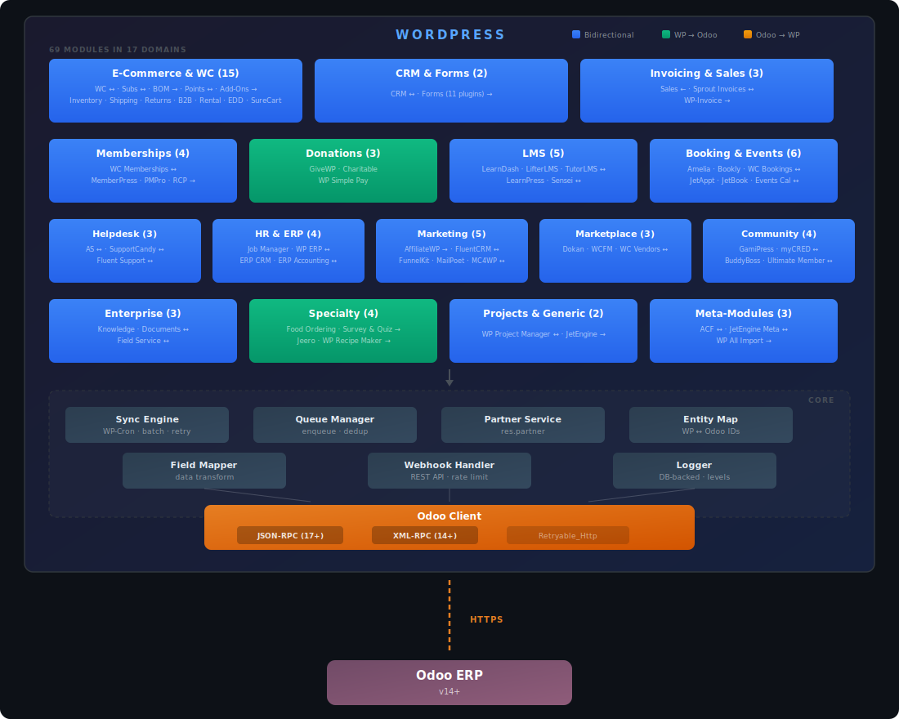

# WordPress For Odoo (WP4Odoo)

[](https://github.com/PaulArgoud/wordpress-for-odoo/actions/workflows/ci.yml)


Modular WordPress plugin that creates a seamless, bidirectional bridge between WordPress/WooCommerce and Odoo ERP (v14+). Built on a clean, extensible architecture with 30 integration modules, an async sync queue, and full WP-CLI support. Ships in **3 languages** (English, French, Spanish).

**Target users:** WordPress agencies and businesses running Odoo as their ERP who need reliable, real-time data flow between their website and back-office.


## Features

- **Async Queue** — No API calls during user requests; all sync jobs go through a persistent database queue with exponential backoff, deduplication, and configurable batch size
- **Dual Transport** — JSON-RPC 2.0 (default for Odoo 17+) and XML-RPC (legacy), swappable via settings, shared HTTP layer via `Retryable_Http` trait. Retry orchestration at queue level (exponential backoff via `Sync_Engine`)
- **Encrypted Credentials** — API keys encrypted at rest with libsodium (OpenSSL fallback)
- **Webhooks** — REST API endpoints for real-time notifications from Odoo, with per-IP rate limiting
- **Admin Dashboard** — 5-tab settings interface (Connection, Sync, Modules, Queue, Logs) with guided onboarding
- **WP-CLI** — Full command suite: `wp wp4odoo status|test|sync|queue|module` for headless management
- **WPML / Polylang Translation Sync** — Multilingual product sync via WPML or Polylang: pushes translated names/descriptions to Odoo with language context, pulls translations back to create/update translated posts. Category and attribute value translations included
- **Extensible** — Register custom modules via `wp4odoo_register_modules`; filter data with `wp4odoo_map_to_odoo_*` / `wp4odoo_map_from_odoo_*`; map ACF custom fields to Odoo via the ACF meta-module
- **Multilingual** — 509 translatable strings, ships with English, French, and Spanish. Translation-ready via `.po`/`.mo`

## Requirements

PHP 8.2+, MySQL 8.0+ / MariaDB 10.5+, WordPress 6.0+, Odoo 17+ (JSON-RPC) or 14+ (XML-RPC).

### Odoo Compatibility

| Versions | On-Premise | Odoo.sh   | Online  | One App Free |
|:---------|:----------:|:---------:|:-------:|:------------:|
| 17 – 19  | ✅ Full³   | ✅ Full³ | ✅ Full | ⚠️ Partial²  |
| 14 – 16  | ✅ Full³   | ✅ Full³ | N/A¹    | N/A¹         |
| < 14     | ❌         | ❌       | N/A¹    | N/A¹         |

> ¹ Odoo Online always runs the latest stable version (currently 17+), so older versions do not apply.
>
> ² **[One App Free](https://www.odoo.com/pricing)** is Odoo's free plan (one app, unlimited users). WP4Odoo modules require multiple Odoo apps (see table below), so only a subset of features will work. Upgrade to the Standard plan for full compatibility.
>
> ³ Works with both Odoo **Community** (free) and **Enterprise** editions — all required apps are included in Community.

- **Odoo 17+** — uses JSON-RPC 2.0 (default, recommended)
- **Odoo 14 – 16** — uses XML-RPC (legacy transport, select in plugin settings)
- **Odoo < 14** — not supported (external API incompatibilities)

All hosting types expose the standard Odoo external API used by the plugin. No custom Odoo modules are required — only the standard apps listed in the module tables below.

## Installation

1. Download or clone this repository into `wp-content/plugins/wordpress-for-odoo/`
2. Activate the plugin from the WordPress admin
3. Go to **Odoo Connector** in the admin menu
4. Enter your Odoo credentials (URL, database, username, API key) in the **Connection** tab
5. Click **Test Connection** to verify
6. Enable the modules you need in the **Modules** tab

## Module System

Each Odoo domain is encapsulated in an independent module extending `Module_Base`. The plugin automatically detects missing Odoo apps at connection test and module activation.

**Sync direction:** ↔️ Bidirectional — ➡️ WP to Odoo — ⬅️ Odoo to WP

### E-Commerce

| Module                        | Sync | Odoo Apps                             | Free⁴ | Key Features                                                              |
|-------------------------------|:----:|---------------------------------------|:-----:|---------------------------------------------------------------------------|
| **WooCommerce**               |  ↔️  | Contacts, Sales, Inventory, Invoicing |  ❌  | Product/order/stock/category sync, variants, image pull, exchange rates, bulk ops |
| **WooCommerce Subscriptions** |  ↔️  | Contacts, Subscriptions, Invoicing    |  ❌  | Subscription/renewal sync, dual-model (sale.subscription / account.move)  |
| **WC Points & Rewards**      |  ↔️  | Contacts, Loyalty                     |  ❌  | Point balance sync via loyalty.card, find-or-create by partner+program    |
| **Easy Digital Downloads**    |  ↔️  | Contacts, Sales, Invoicing            |  ❌  | Download/order sync, status mapping, invoice pull                         |
| **Ecwid**                     |  ➡️  | Contacts, Sales                       |  ❌  | Product/order sync via WP-Cron polling, REST API, hash-based detection    |
| **ShopWP**                    |  ➡️  | Products                              |  ❌  | Shopify product sync via CPT + custom table, variant price/SKU            |
| **WP Crowdfunding**           |  ➡️  | Products                              |  ❌  | Campaign sync as service products, funding description, coexists with WC  |

### HR

| Module                | Sync | Odoo Apps    | Free⁴ | Key Features                                                                   |
|-----------------------|------|--------------|-------|--------------------------------------------------------------------------------|
| **WP Job Manager**    |  ↔️  | HR Recruitment                        |  ✅  | Job listings ↔ hr.job, status mapping (publish ↔ recruit), department pull    |

### CRM & Forms

| Module                | Sync | Odoo Apps    | Free⁴ | Key Features                                                                   |
|-----------------------|:----:|--------------|:-----:|--------------------------------------------------------------------------------|
| **CRM**               |  ↔️  | Contacts, CRM |  ⚠️  | Contact sync, lead form shortcode, email dedup, archive-on-delete              |
| **Forms (7 plugins)** |  ➡️  | Contacts, CRM |  ⚠️  | GF, WPForms, CF7, Fluent, Formidable, Ninja, Forminator — lead auto-detection |

### Invoicing & Sales

| Module              | Sync | Odoo Apps                  | Free⁴ | Key Features                                                                    |
|---------------------|:----:|----------------------------|:-----:|---------------------------------------------------------------------------------|
| **Sales**           |  ⬅️  | Contacts, Sales, Invoicing |  ❌  | Order/invoice CPTs, customer portal shortcode, currency display                 |
| **Sprout Invoices** |  ↔️  | Contacts, Invoicing        |  ⚠️  | Invoice/payment sync, status mapping, auto-posting, One2many line items, pull   |
| **WP-Invoice**      |  ➡️  | Contacts, Invoicing        |  ⚠️  | Invoice sync, auto-posting for paid invoices, One2many line items               |

### Memberships

| Module                      | Sync | Odoo Apps                    | Free⁴ | Key Features                                                                    |
|-----------------------------|:----:|------------------------------|:-----:|---------------------------------------------------------------------------------|
| **WooCommerce Memberships** |  ↔️  | Contacts, Members            |  ❌  | Plan sync (bidirectional), membership status/date pull, reverse status mapping   |
| **MemberPress**             |  ➡️  | Contacts, Members, Invoicing |  ❌  | Plan/txn/sub sync, auto-post invoices, status mapping                           |
| **Paid Memberships Pro**    |  ➡️  | Contacts, Members, Invoicing |  ❌  | Level/order/membership sync, auto-post invoices, status mapping                 |
| **Restrict Content Pro**    |  ➡️  | Contacts, Members, Invoicing |  ❌  | Level/payment/membership sync, auto-post invoices, status mapping               |

### Donations & Payments

| Module            | Sync | Odoo Apps                            | Free⁴ | Key Features                                                                    |
|-------------------|:----:|--------------------------------------|:-----:|---------------------------------------------------------------------------------|
| **GiveWP**        |  ➡️  | Contacts, Invoicing (+ OCA Donation) |  ⚠️  | Form/donation sync, dual-model detection, auto-validate, recurring donations    |
| **WP Charitable** |  ➡️  | Contacts, Invoicing (+ OCA Donation) |  ⚠️  | Campaign/donation sync, dual-model detection, auto-validate, recurring          |
| **WP Simple Pay** |  ➡️  | Contacts, Invoicing (+ OCA Donation) |  ⚠️  | Stripe payment sync, webhook capture, dual-model, auto-validate, recurring      |

### LMS (Learning)

| Module        | Sync | Odoo Apps                  | Free⁴ | Key Features                                                                          |
|---------------|:----:|----------------------------|:-----:|---------------------------------------------------------------------------------------|
| **LearnDash** |  ↔️  | Contacts, Sales, Invoicing |  ❌  | Course/group/transaction/enrollment sync, auto-post invoices, course/group pull        |
| **LifterLMS** |  ↔️  | Contacts, Sales, Invoicing |  ❌  | Course/membership/order/enrollment sync, auto-post invoices, course/membership pull    |

### Booking & Events

| Module              | Sync | Odoo Apps                     | Free⁴ | Key Features                                                                    |
|---------------------|:----:|-------------------------------|:-----:|---------------------------------------------------------------------------------|
| **Amelia Booking**  |  ↔️  | Contacts, Calendar            |  ⚠️  | Service sync (bidirectional), appointment sync (push), customer-to-partner      |
| **Bookly Booking**  |  ↔️  | Contacts, Calendar            |  ⚠️  | Service sync (bidirectional), booking sync (push) via WP-Cron, hash detection   |
| **WC Bookings**     |  ↔️  | Contacts, Calendar            |  ⚠️  | Booking product/booking sync, all-day support, persons count, status filter     |
| **Events Calendar** |  ↔️  | Contacts, Events (+ Calendar) |  ⚠️  | Event/ticket/attendee sync, dual-model (event.event or calendar.event)          |

### Helpdesk & Support

| Module              | Sync | Odoo Apps                     | Free⁴ | Key Features                                                                    |
|---------------------|:----:|-------------------------------|:-----:|---------------------------------------------------------------------------------|
| **Awesome Support** |  ↔️  | Contacts, Helpdesk (+ Project) |  ⚠️  | Ticket/status sync, dual-model (helpdesk.ticket or project.task), stage heuristic |
| **SupportCandy**    |  ↔️  | Contacts, Helpdesk (+ Project) |  ⚠️  | Ticket/status sync, dual-model, custom table data access, stage heuristic        |

### Cross-Module

| Module                        | Sync | Odoo Apps | Free⁴ | Key Features                                                                    |
|-------------------------------|:----:|-----------|:-----:|---------------------------------------------------------------------------------|
| **ACF (Advanced Custom Fields)** |  ↔️  | —         |  —   | Maps ACF custom fields ↔ Odoo `x_*` fields via filters, 9 type conversions     |

### Other

| Module              | Sync | Odoo Apps | Free⁴ | Key Features                                                    |
|---------------------|:----:|-----------|:-----:|-----------------------------------------------------------------|
| **WP Recipe Maker** |  ➡️  | Products  |  ❌  | Recipe sync as service products, structured descriptions         |

> ⁴ **[One App Free](https://www.odoo.com/pricing)**: with CRM as your free app, CRM and Forms modules work. With Invoicing as your free app, GiveWP, WP Charitable, WP Simple Pay, Sprout Invoices, and WP-Invoice work. With Calendar as your free app, Amelia, Bookly, WC Bookings, and Events Calendar (fallback mode) work (partial — no Contacts). With Helpdesk as your free app, Awesome Support and SupportCandy work (partial — no Contacts). Sales, WooCommerce, WooCommerce Subscriptions (Enterprise), WC Points & Rewards, Memberships (MemberPress/PMPro/RCP/WC Memberships), LMS (LearnDash/LifterLMS), Ecwid, and WP Recipe Maker require 2–4 apps.

## Usage

### Shortcodes

| Shortcode                   | Description                                                                                       |
|-----------------------------|---------------------------------------------------------------------------------------------------|
| `[wp4odoo_customer_portal]` | Customer portal with Orders and Invoices tabs (requires logged-in user linked to an Odoo partner) |
| `[wp4odoo_lead_form]`       | Lead capture form with AJAX submission, creates `crm.lead` in Odoo                                |

### WP-CLI

```bash
wp wp4odoo status                    # Connection info, queue stats, modules
wp wp4odoo test                      # Test Odoo connection
wp wp4odoo sync run                  # Process sync queue
wp wp4odoo sync run --dry-run        # Preview sync without changes
wp wp4odoo queue stats               # Queue statistics
wp wp4odoo queue list --page=1       # Paginated job list
wp wp4odoo queue retry               # Retry all failed jobs
wp wp4odoo queue cleanup --days=7    # Delete old completed/failed jobs
wp wp4odoo queue cancel 42           # Cancel a pending job
wp wp4odoo module list               # List modules with status
wp wp4odoo module enable crm         # Enable a module
wp wp4odoo module disable crm        # Disable a module
```

### REST API & Hooks

The plugin exposes 3 REST endpoints under `wp-json/wp4odoo/v1/` (webhook receiver, health check, manual sync trigger) and 6 action hooks + 20 data filters for customization.

## Architecture



All synchronization goes through a persistent database queue — no Odoo API calls are made during user requests:

1. A WordPress or Odoo event triggers a sync job
2. The job is enqueued in `wp4odoo_sync_queue`
3. A WP-Cron task processes the queue in configurable batches
4. Data is transformed via `Field_Mapper` and sent through `Odoo_Client`
5. Entity mappings are stored in `wp4odoo_entity_map` with sync hashes for change detection

### Security

- API keys encrypted at rest (libsodium with OpenSSL fallback)
- Admin AJAX handlers protected by nonce + `manage_options` capability
- Webhooks authenticated via `X-Odoo-Token` header + per-IP rate limiting (100 req/min)
- All inputs sanitized (`sanitize_text_field`, `esc_url_raw`, `absint`)
- `index.php` in every subdirectory to prevent directory listing

## Development

```bash
composer install
composer check          # Runs PHPCS + PHPUnit + PHPStan (mirrors CI)
```

Integration tests require Docker.

- 📖 [ARCHITECTURE.md](ARCHITECTURE.md) — Class diagrams, data flows, REST API endpoints, hooks & filters reference
- 📋 [CONTRIBUTING.md](CONTRIBUTING.md) — Development setup, coding standards, testing, translations, commit conventions, PR checklist
- 📝 [CHANGELOG.md](CHANGELOG.md) — Version history

## Support the Project

WP4Odoo is free and open source. If it saves you time or money, consider throwing a few bucks my way — it keeps the lights on and the commits flowing.

[](https://github.com/sponsors/PaulArgoud)
[](bitcoin:TON_ADRESSE_BTC)
[](https://paypal.me/paulargoud)

## License

[GPL v2 or later](LICENSE)