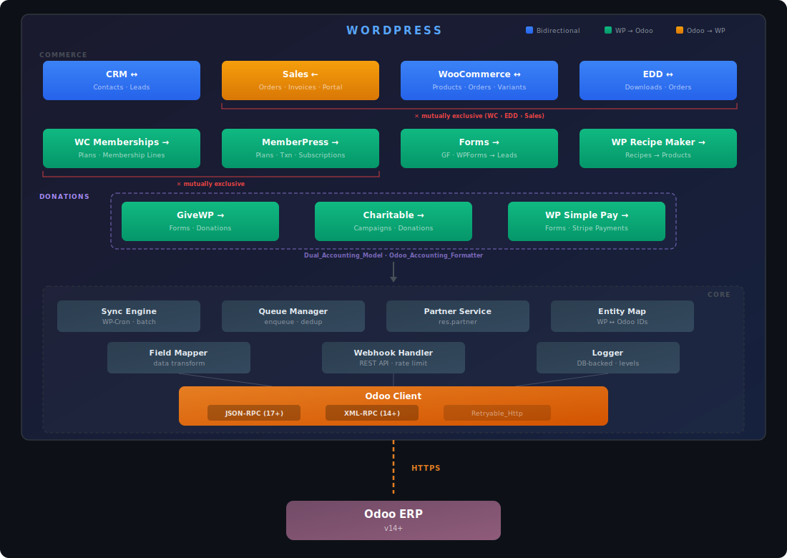

# WordPress For Odoo (WP4Odoo)

[](https://github.com/PaulArgoud/wordpress-for-odoo/actions/workflows/ci.yml)

Modular WordPress plugin that creates a seamless, bidirectional bridge between WordPress/WooCommerce and Odoo ERP (v14+).

Built on a clean, extensible architecture, it covers a wide range of integrations: CRM, Sales & Invoicing, WooCommerce, WooCommerce Subscriptions, Easy Digital Downloads, Memberships, MemberPress, Paid Memberships Pro, Restrict Content Pro, GiveWP, WP Charitable, WP Simple Pay (Stripe), WP Recipe Maker, LearnDash, LifterLMS, Amelia Booking, Bookly Booking, and form-based lead capture.

Ships in **3 languages** (English, French, Spanish) and is fully translation-ready.

**Target users:** WordPress agencies and businesses running Odoo as their ERP who need reliable, real-time data flow between their website and back-office.


## Features

- **Admin Dashboard** — 5-tab settings interface: Connection, Sync, Modules, Queue, Logs
- **Async Queue** — No API calls during user requests; all sync jobs go through a persistent database queue with exponential backoff, deduplication, and configurable batch size
- **Code Quality** — WordPress Coding Standards (PHPCS), PHPStan level 5 static analysis, 1431 unit tests + 26 integration tests, CI/CD with GitHub Actions
- **Dual Transport** — JSON-RPC 2.0 (default for Odoo 17+) and XML-RPC (legacy), swappable via settings, shared retry logic via `Retryable_Http` trait (3 attempts, exponential backoff + jitter)
- **Encrypted Credentials** — API keys encrypted at rest with libsodium (OpenSSL fallback)
- **Extensible** — Register custom modules via `wp4odoo_register_modules` action hook; filter data with `wp4odoo_map_to_odoo_*` / `wp4odoo_map_from_odoo_*`
- **Multilingual (3 languages)** — Fully internationalized with WordPress standard Gettext i18n. Ships with English (source), French, and Spanish translations (337 strings). Translation-ready for additional languages via `.po`/`.mo` files
- **Onboarding** — Post-activation redirect, setup notice, 3-step checklist with progress bar, inline Odoo documentation (API keys, webhooks)
- **Webhooks** — REST API endpoints for real-time notifications from Odoo, with per-IP rate limiting
- **WP-CLI** — Full command suite: `wp wp4odoo status|test|sync|queue|module` for headless management

## Requirements

- PHP 8.2+
- Odoo 17+ (JSON-RPC) or Odoo 14+ (XML-RPC)
- WordPress 6.0+

## Compatibility

### By Odoo version and hosting type

| Versions | On-Premise | Odoo.sh   | Online  | One App Free |
|:---------|:----------:|:---------:|:-------:|:------------:|
| 17 – 19  | ✅ Full³   | ✅ Full³ | ✅ Full | ⚠️ Partial²  |
| 14 – 16  | ✅ Full³   | ✅ Full³ | N/A¹    | N/A¹         |
| < 14     | ❌         | ❌       | N/A¹    | N/A¹         |

> ¹ Odoo Online always runs the latest stable version (currently 17+), so older versions do not apply.
>
> ² **[One App Free](https://www.odoo.com/pricing)** is Odoo's free plan (one app, unlimited users). WP4Odoo modules require multiple Odoo apps (see table below), so only a subset of features will work. Upgrade to the Standard plan for full compatibility.
>
> ³ Works with both Odoo **Community** (free) and **Enterprise** editions — all required apps are included in Community.

- **Odoo 17+** — uses JSON-RPC 2.0 (default, recommended)
- **Odoo 14 – 16** — uses XML-RPC (legacy transport, select in plugin settings)
- **Odoo < 14** — not supported (external API incompatibilities)

All hosting types expose the standard Odoo external API used by the plugin. No custom Odoo modules are required — only the standard apps listed in the [module table](#module-system) below.

## Installation

1. Download or clone this repository into `wp-content/plugins/wordpress-for-odoo/`
2. Activate the plugin from the WordPress admin
3. Go to **Odoo Connector** in the admin menu
4. Enter your Odoo credentials (URL, database, username, API key) in the **Connection** tab
5. Click **Test Connection** to verify
6. Enable the modules you need in the **Modules** tab

## Module System

Each Odoo domain is encapsulated in an independent module extending `Module_Base`. The plugin automatically detects missing Odoo apps at connection test and module activation.

| WP4Odoo Modules             | Synch. | Odoo Apps                             | Free⁴ | Key Features                                                                  |
|-----------------------------|:------:|---------------------------------------|:-----:|-------------------------------------------------------------------------------|
| **CRM**                     |   ↔️   | Contacts, CRM                         |  ⚠️  | Contact sync, lead form shortcode, email dedup, archive-on-delete              |
| **Sales**                   |   ⬅️   | Contacts, Sales, Invoicing            |  ❌  | Order/invoice CPTs, customer portal shortcode, currency display                |
| **Amelia Booking**          |   ➡️   | Contacts, Calendar                    |  ⚠️  | Service/appointment sync, calendar events, customer-to-partner resolution      |
| **Bookly Booking**          |   ➡️   | Contacts, Calendar                    |  ⚠️  | Service/booking sync via WP-Cron polling, hash-based change detection          |
| **Easy Digital Downloads**  |   ↔️   | Contacts, Sales, Invoicing            |  ❌  | Download/order sync, status mapping, invoice pull                              |
| **Forms (7 plugins)**       |   ➡️   | Contacts, CRM                         |  ⚠️  | GF, WPForms, CF7, Fluent, Formidable, Ninja, Forminator — lead auto-detection |
| **GiveWP**                  |   ➡️   | Contacts, Invoicing (+ OCA Donation)  |  ⚠️  | Form/donation sync, dual-model detection, auto-validate, recurring donations   |
| **LearnDash**               |   ➡️   | Contacts, Sales, Invoicing            |  ❌  | Course/group/transaction/enrollment sync, auto-post invoices                   |
| **LifterLMS**               |   ➡️   | Contacts, Sales, Invoicing            |  ❌  | Course/membership/order/enrollment sync, auto-post invoices                    |
| **MemberPress**             |   ➡️   | Contacts, Members, Invoicing          |  ❌  | Plan/txn/sub sync, auto-post invoices, status mapping                          |
| **Paid Memberships Pro**    |   ➡️   | Contacts, Members, Invoicing          |  ❌  | Level/order/membership sync, auto-post invoices, status mapping                |
| **Restrict Content Pro**    |   ➡️   | Contacts, Members, Invoicing          |  ❌  | Level/payment/membership sync, auto-post invoices, status mapping              |
| **WP Charitable**           |   ➡️   | Contacts, Invoicing (+ OCA Donation)  |  ⚠️  | Campaign/donation sync, dual-model detection, auto-validate, recurring         |
| **WP Recipe Maker**         |   ➡️   | Products                              |  ❌  | Recipe sync as service products, structured descriptions, push-only            |
| **WP Simple Pay**           |   ➡️   | Contacts, Invoicing (+ OCA Donation)  |  ⚠️  | Stripe payment sync, webhook capture, dual-model, auto-validate, recurring     |
| **WooCommerce**             |   ↔️   | Contacts, Sales, Inventory, Invoicing |  ❌  | Product/order/stock sync, variants, image pull, exchange rates, bulk ops       |
| **WooCommerce Memberships** |   ➡️   | Contacts, Members                     |  ❌  | Plan auto-sync, status mapping, filterable via `wp4odoo_membership_status_map` |
| **WooCommerce Subscriptions** | ➡️   | Contacts, Subscriptions, Invoicing    |  ❌  | Subscription/renewal sync, dual-model (sale.subscription / account.move)       |

> ⁴ **[One App Free](https://www.odoo.com/pricing)**: with CRM as your free app, CRM and Forms modules work. With Invoicing as your free app, GiveWP, WP Charitable, and WP Simple Pay work. With Calendar as your free app, Amelia and Bookly work (partial — no Contacts). Sales, WooCommerce, WooCommerce Subscriptions (Enterprise), Memberships (MemberPress/PMPro/RCP/WC Memberships), LMS (LearnDash/LifterLMS), and WP Recipe Maker require 2–4 apps.

### Third-party modules

Third-party modules can be registered:

```php
add_action('wp4odoo_register_modules', function($plugin) {
    $plugin->register_module('my_module', new My_Custom_Module());
});
```

## Odoo Modules

Modules that sync with Odoo's built-in apps. These cover core business functions (CRM, Sales) and work out of the box with any Odoo 14+ instance — no custom Odoo development required.

### [CRM](https://www.odoo.com/fr_FR/app/crm-features)

Bidirectional contact sync (WP users <-> `res.partner`), lead capture form with shortcode, email deduplication, archive-on-delete, role-based filtering, country/state resolution

### [Sales](https://www.odoo.com/fr_FR/app/sales-features)

Order and invoice sync from Odoo, custom post types for local storage, customer portal with tabbed UI and currency display (`[wp4odoo_customer_portal]`)

## WordPress Modules

Modules that bridge popular WordPress plugins with Odoo. Each module listens to its plugin's hooks (or polls when hooks are unavailable) and pushes data to the appropriate Odoo models automatically.

### [Amelia](https://wpamelia.com) ([directory](https://wordpress.org/plugins/ameliabooking/))

Push Amelia Booking services to Odoo as service products (`product.product`) and appointments as calendar events (`calendar.event`), with automatic customer-to-partner resolution, event naming "Service — Customer", and service auto-sync before appointment push

### [Bookly](https://www.booking-wp-plugin.com) ([directory](https://wordpress.org/plugins/bookly-responsive-appointment-booking-tool/))

Push Bookly Booking services and appointments to Odoo via **WP-Cron polling** (Bookly has no WordPress hooks). Services synced as `product.product`, customer appointments as `calendar.event`, with SHA-256 hash-based change detection, automatic customer-to-partner resolution, and service auto-sync before booking push

### [Easy Digital Downloads](https://easydigitaldownloads.com) ([directory](https://wordpress.org/plugins/easy-digital-downloads/))

Bidirectional sync for Easy Digital Downloads: downloads (`product.template`), orders (`sale.order`), invoices (`account.move`), EDD↔Odoo status mapping, partner resolution (mutually exclusive with WooCommerce and Sales modules)

### Forms Module

Automatic lead creation in Odoo from **7 form plugins**: Gravity Forms, WPForms, Contact Form 7, Fluent Forms, Formidable Forms, Ninja Forms, and Forminator. Field auto-detection (name, email, phone, company, message), multilingual label matching, and filterable via `wp4odoo_form_lead_data`

### [LearnDash](https://www.learndash.com) ([directory](https://wordpress.org/plugins/sfwd-lms/))

Push LearnDash LMS data to Odoo: courses and groups as service products (`product.product`), transactions as invoices (`account.move` with auto-posting), enrollments as sale orders (`sale.order`), with automatic product sync before dependent entities and partner resolution

### [LifterLMS](https://lifterlms.com) ([directory](https://wordpress.org/plugins/lifterlms/))

Push LifterLMS data to Odoo: courses and memberships as service products (`product.product`), orders as invoices (`account.move` with auto-posting), enrollments as sale orders (`sale.order`), with automatic product sync before dependent entities and partner resolution

### [GiveWP](https://givewp.com) ([directory](https://wordpress.org/plugins/give/))

Push GiveWP donations to Odoo accounting with **full recurring donation support**.
Dual Odoo model: auto-detects OCA `donation.donation` module, falls back to `account.move` (invoices).
Forms synced as products, donations with auto-validation, guest donor support, filterable status mapping (`wp4odoo_givewp_donation_status_map`)

### [MemberPress](https://memberpress.com) ([directory](https://wordpress.org/plugins/members/))

Push MemberPress recurring subscriptions to Odoo: plans as membership products, transactions as invoices (`account.move` with auto-posting), subscriptions as membership lines, with status mapping and filterable hooks (`wp4odoo_mepr_txn_status_map`, `wp4odoo_mepr_sub_status_map`)

### [Paid Memberships Pro](https://www.paidmembershipspro.com) ([directory](https://wordpress.org/plugins/paid-memberships-pro/))

Push PMPro membership data to Odoo: levels as membership products (`product.product`), payment orders as invoices (`account.move` with auto-posting), user memberships as membership lines (`membership.membership_line`), with automatic level sync, status mapping, and partner resolution (mutually exclusive with MemberPress, RCP, and WC Memberships)

### [Restrict Content Pro](https://restrictcontentpro.com)

Push Restrict Content Pro membership data to Odoo: levels as membership products (`product.product`), payments as invoices (`account.move` with auto-posting), user memberships as membership lines (`membership.membership_line`), with automatic level sync, status mapping, and partner resolution (mutually exclusive with MemberPress, PMPro, and WC Memberships)

### [WooCommerce](https://woocommerce.com) ([directory](https://wordpress.org/plugins/woocommerce/))

WC-native product, order, and stock sync with Odoo status mapping, HPOS compatible, product variant import from Odoo, product image pull, multi-currency with optional exchange rate conversion (prices auto-converted using Odoo rates, or skipped on mismatch), bulk product import/export (mutually exclusive with EDD and Sales modules)

### [WooCommerce Memberships](https://woocommerce.com/fr/products/woocommerce-memberships/)

Push WooCommerce Memberships (plans + user memberships) to Odoo's native `membership` module, with status mapping and automatic plan sync

### [WooCommerce Subscriptions](https://woocommerce.com/products/woocommerce-subscriptions/)

Push recurring subscriptions to Odoo `sale.subscription` (Enterprise 14-16, auto-detected via `ir.model` probe) with billing period mapping (day/week/month/year) and status sync (7 WCS statuses → Odoo states). Renewal orders synced as `account.move` invoices with optional auto-posting. Independent module — coexists with the standard WooCommerce module

### [WP Charitable](https://www.wpcharitable.com) ([directory](https://wordpress.org/plugins/charitable/))

Push WP Charitable donations to Odoo accounting with **full recurring donation support**.
Same dual Odoo model as GiveWP (OCA `donation.donation` / `account.move`).
Campaigns synced as products, donations with auto-validation, guest donor support, 6-entry status mapping, filterable via `wp4odoo_charitable_donation_status_map`

### [WP Recipe Maker](https://bootstrapped.ventures/wp-recipe-maker/) ([directory](https://fr.wordpress.org/plugins/wp-recipe-maker/))

Push WP Recipe Maker recipes to Odoo as service products (`product.product`), with structured descriptions including summary, preparation/cooking times, and servings

### [WP Simple Pay](https://wpsimplepay.com/) ([directory](https://fr.wordpress.org/plugins/stripe/))

Push WP Simple Pay Stripe payments to Odoo accounting with **full recurring subscription support**.
Same dual Odoo model as GiveWP (OCA `donation.donation` / `account.move`).
Forms synced as products, Stripe payments captured via webhook with hidden tracking CPT, deduplication by PaymentIntent ID, auto-validation, guest payer support

## Shortcodes

| Shortcode                   | Description                                                                                       |
|-----------------------------|---------------------------------------------------------------------------------------------------|
| `[wp4odoo_customer_portal]` | Customer portal with Orders and Invoices tabs (requires logged-in user linked to an Odoo partner) |
| `[wp4odoo_lead_form]`       | Lead capture form with AJAX submission, creates `crm.lead` in Odoo                                |

## WP-CLI

```bash
wp wp4odoo status                    # Connection info, queue stats, modules
wp wp4odoo test                      # Test Odoo connection
wp wp4odoo sync run                  # Process sync queue
wp wp4odoo sync run --dry-run        # Preview sync without changes
wp wp4odoo queue stats               # Queue statistics
wp wp4odoo queue list --page=1       # Paginated job list
wp wp4odoo queue retry               # Retry all failed jobs
wp wp4odoo queue cleanup --days=7    # Delete old completed/failed jobs
wp wp4odoo queue cancel 42           # Cancel a pending job
wp wp4odoo module list               # List modules with status
wp wp4odoo module enable crm         # Enable a module
wp wp4odoo module disable crm        # Disable a module
```

## REST API

Namespace: `wp-json/wp4odoo/v1/`

| Endpoint                  | Method  | Auth               | Description                                |
|---------------------------|---------|--------------------|--------------------------------------------|
| `/webhook`                | POST    | Token + rate limit | Receives change notifications from Odoo    |
| `/webhook/test`           | GET     | Public             | Health check                               |
| `/sync/{module}/{entity}` | POST    | WP Auth            | Triggers sync for a specific module/entity |

## Hooks

### Actions

| Hook                       | Description                                       |
|----------------------------|---------------------------------------------------|
| `wp4odoo_init`             | Plugin initialized                                |
| `wp4odoo_loaded`           | All plugins loaded                                |
| `wp4odoo_register_modules` | Register custom modules                           |
| `wp4odoo_lead_created`     | Lead form submitted                               |
| `wp4odoo_api_call`         | Every Odoo API call (model, method, args, result) |

### Filters

| Filter                                    | Description                       |
|-------------------------------------------|-----------------------------------|
| `wp4odoo_map_to_odoo_{module}_{entity}`   | Modify data before push to Odoo   |
| `wp4odoo_map_from_odoo_{module}_{entity}` | Modify data during pull from Odoo |
| `wp4odoo_ssl_verify`                      | Enable/disable SSL verification   |

## Architecture



### Sync Flow

All synchronization goes through a persistent database queue — no Odoo API calls are made during user requests:

1. A WordPress or Odoo event triggers a sync job
2. The job is enqueued in `wp4odoo_sync_queue`
3. A WP-Cron task processes the queue in configurable batches
4. Data is transformed via `Field_Mapper` and sent through `Odoo_Client`
5. Entity mappings are stored in `wp4odoo_entity_map` with sync hashes for change detection

### Security

- API keys encrypted at rest (libsodium with OpenSSL fallback)
- Admin AJAX handlers protected by nonce + `manage_options` capability
- Webhooks authenticated via `X-Odoo-Token` header + per-IP rate limiting (100 req/min)
- All inputs sanitized (`sanitize_text_field`, `esc_url_raw`, `absint`)
- `index.php` in every subdirectory to prevent directory listing

## Development

For detailed architecture, class diagrams, and data flows, see [ARCHITECTURE.md](ARCHITECTURE.md). For version history, see [CHANGELOG.md](CHANGELOG.md).

### Testing

```bash
# Install dependencies
composer install

# Unit tests (PHPUnit)
php vendor/bin/phpunit

# Static analysis (PHPStan level 5)
php -d memory_limit=1G vendor/bin/phpstan analyse --memory-limit=1G

# Coding standards (PHPCS — WordPress-Extra)
php vendor/bin/phpcs

# Integration tests (requires Docker)
npm install
npx wp-env start
npm run test:integration
npx wp-env stop
```

### Contributing

1. Fork the repository
2. Create a feature branch (`git checkout -b feature/my-feature`)
3. Ensure all checks pass: `php vendor/bin/phpunit && php vendor/bin/phpstan analyse --memory-limit=1G && php vendor/bin/phpcs`
4. Commit and open a Pull Request

### Translations

After adding or changing user-facing strings:

```bash
# Extract strings
xgettext --language=PHP --keyword=__ --keyword=_e --keyword=esc_html__ \
    --keyword=esc_html_e --keyword=esc_attr__ --keyword=esc_attr_e \
    --from-code=UTF-8 -o languages/wp4odoo.pot \
    wp4odoo.php includes/**/*.php admin/views/*.php templates/*.php

# Update translations
msgmerge --update languages/wp4odoo-fr_FR.po languages/wp4odoo.pot
msgmerge --update languages/wp4odoo-es_ES.po languages/wp4odoo.pot

# Compile
msgfmt -o languages/wp4odoo-fr_FR.mo languages/wp4odoo-fr_FR.po
msgfmt -o languages/wp4odoo-es_ES.mo languages/wp4odoo-es_ES.po
```

## License

[GPL v2 or later](LICENSE)