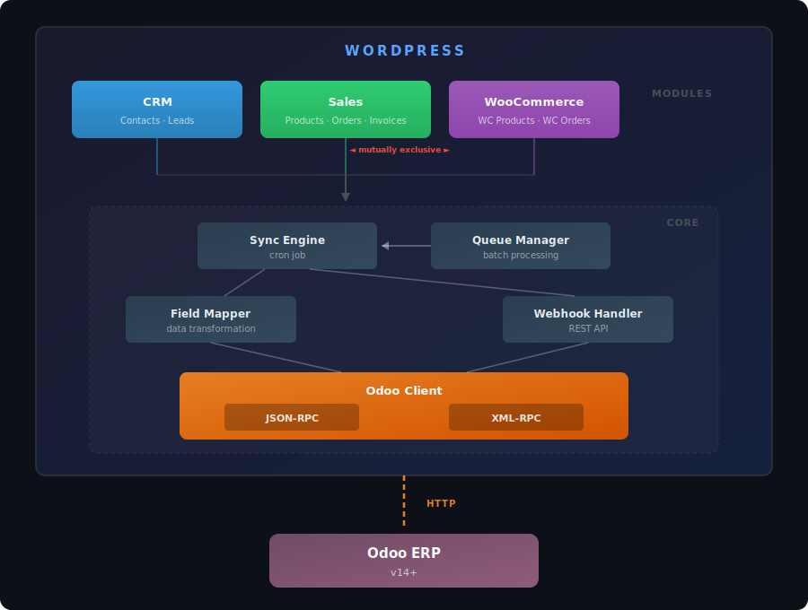

# WordPress For Odoo (WP4Odoo)

[](https://github.com/PaulArgoud/wordpress-for-odoo/actions/workflows/ci.yml)

Modular WordPress plugin providing comprehensive, bidirectional integration between WordPress/WooCommerce and Odoo ERP (v14+). Covers CRM, Sales & Invoicing, and WooCommerce synchronization through a clean, extensible architecture.

**Target users:** WordPress agencies and businesses running Odoo as their ERP who need seamless data flow between their website and back-office.


## Features

- **CRM Module** — Bidirectional contact sync (WP users <-> `res.partner`), lead capture form with shortcode, email deduplication, archive-on-delete, role-based filtering, country/state resolution
- **Sales Module** — Order and invoice sync from Odoo, custom post types for local storage, customer portal with tabbed UI and currency display (`[wp4odoo_customer_portal]`)
- **WooCommerce Module** — WC-native product, order, and stock sync with Odoo status mapping, HPOS compatible, product variant import from Odoo, product image pull, multi-currency guard (skips price if currency mismatch), bulk product import/export (mutually exclusive with Sales module)
- **Async Queue** — No API calls during user requests; all sync jobs go through a persistent database queue with exponential backoff, deduplication, and configurable batch size
- **Dual Transport** — JSON-RPC 2.0 (default for Odoo 17+) and XML-RPC (legacy), swappable via settings, shared retry logic via `Retryable_Http` trait (3 attempts, exponential backoff + jitter)
- **Webhooks** — REST API endpoints for real-time notifications from Odoo, with per-IP rate limiting
- **Encrypted Credentials** — API keys encrypted at rest with libsodium (OpenSSL fallback)
- **Admin Dashboard** — 5-tab settings interface: Connection, Sync, Modules, Queue, Logs
- **Onboarding** — Post-activation redirect, setup notice, 3-step checklist with progress bar, inline Odoo documentation (API keys, webhooks)
- **WP-CLI** — Full command suite: `wp wp4odoo status|test|sync|queue|module` for headless management
- **Extensible** — Register custom modules via `wp4odoo_register_modules` action hook; filter data with `wp4odoo_map_to_odoo_*` / `wp4odoo_map_from_odoo_*`
- **Internationalized** — English source strings, French translation included (249 strings)

## Requirements

- PHP 8.2+
- WordPress 6.0+
- Odoo 17+ (JSON-RPC) or Odoo 14+ (XML-RPC)
- WooCommerce (optional, for WooCommerce module)

## Installation

1. Download or clone this repository into `wp-content/plugins/wordpress-for-odoo/`
2. Activate the plugin from the WordPress admin
3. Go to **Odoo Connector** in the admin menu
4. Enter your Odoo credentials (URL, database, username, API key) in the **Connection** tab
5. Click **Test Connection** to verify
6. Enable the modules you need in the **Modules** tab

## Architecture



### Module System

Each Odoo domain is encapsulated in an independent module extending `Module_Base`:

| Module          | Odoo Models                                                                        | Key Features                                                                                                                       |
|-----------------|------------------------------------------------------------------------------------|------------------------------------------------------------------------------------------------------------------------------------|
| **CRM**         | `res.partner`, `crm.lead`                                                          | Contact sync, lead form shortcode, email dedup, archive-on-delete                                                                  |
| **Sales**       | `product.template`, `sale.order`, `account.move`                                   | Order/invoice CPTs, customer portal shortcode, currency display                                                                    |
| **WooCommerce** | `product.template`, `product.product`, `sale.order`, `stock.quant`, `account.move` | WC-native product/order/stock sync, product variants, product image pull, multi-currency guard, bulk import/export, status mapping |

Third-party modules can be registered:

```php
add_action( 'wp4odoo_register_modules', function( $plugin ) {
    $plugin->register_module( 'my_module', new My_Custom_Module() );
});
```

### Sync Flow

All synchronization goes through a persistent database queue — no Odoo API calls are made during user requests:

1. A WordPress or Odoo event triggers a sync job
2. The job is enqueued in `wp4odoo_sync_queue`
3. A WP-Cron task processes the queue in configurable batches
4. Data is transformed via `Field_Mapper` and sent through `Odoo_Client`
5. Entity mappings are stored in `wp4odoo_entity_map` with sync hashes for change detection

### Security

- API keys encrypted at rest (libsodium with OpenSSL fallback)
- Admin AJAX handlers protected by nonce + `manage_options` capability
- Webhooks authenticated via `X-Odoo-Token` header + per-IP rate limiting (100 req/min)
- All inputs sanitized (`sanitize_text_field`, `esc_url_raw`, `absint`)
- `index.php` in every subdirectory to prevent directory listing

## Shortcodes

| Shortcode                   | Description                                                                                       |
|-----------------------------|---------------------------------------------------------------------------------------------------|
| `[wp4odoo_customer_portal]` | Customer portal with Orders and Invoices tabs (requires logged-in user linked to an Odoo partner) |
| `[wp4odoo_lead_form]`       | Lead capture form with AJAX submission, creates `crm.lead` in Odoo                                |

## REST API

Namespace: `wp-json/wp4odoo/v1/`

| Endpoint                  | Method  | Auth               | Description                                |
|---------------------------|---------|--------------------|--------------------------------------------|
| `/webhook`                | POST    | Token + rate limit | Receives change notifications from Odoo    |
| `/webhook/test`           | GET     | Public             | Health check                               |
| `/sync/{module}/{entity}` | POST    | WP Auth            | Triggers sync for a specific module/entity |

## Hooks

### Actions

| Hook                       | Description                                       |
|----------------------------|---------------------------------------------------|
| `wp4odoo_init`             | Plugin initialized                                |
| `wp4odoo_loaded`           | All plugins loaded                                |
| `wp4odoo_register_modules` | Register custom modules                           |
| `wp4odoo_lead_created`     | Lead form submitted                               |
| `wp4odoo_api_call`         | Every Odoo API call (model, method, args, result) |

### Filters

| Filter                                    | Description                       |
|-------------------------------------------|-----------------------------------|
| `wp4odoo_map_to_odoo_{module}_{entity}`   | Modify data before push to Odoo   |
| `wp4odoo_map_from_odoo_{module}_{entity}` | Modify data during pull from Odoo |
| `wp4odoo_ssl_verify`                      | Enable/disable SSL verification   |

## WP-CLI

```bash
wp wp4odoo status                    # Connection info, queue stats, modules
wp wp4odoo test                      # Test Odoo connection
wp wp4odoo sync run                  # Process sync queue
wp wp4odoo queue stats               # Queue statistics
wp wp4odoo queue list --page=1       # Paginated job list
wp wp4odoo queue retry               # Retry all failed jobs
wp wp4odoo queue cleanup --days=7    # Delete old completed/failed jobs
wp wp4odoo queue cancel 42           # Cancel a pending job
wp wp4odoo module list               # List modules with status
wp wp4odoo module enable crm         # Enable a module
wp wp4odoo module disable crm        # Disable a module
```

## Development

### Testing

```bash
# Install dependencies
php composer.phar install

# Run PHPUnit tests (416 tests, 811 assertions)
php vendor/bin/phpunit

# Run PHPStan static analysis (level 5, 0 errors on 41 files)
php -d memory_limit=1G vendor/bin/phpstan analyse --memory-limit=1G
```

### Translations

After adding or changing user-facing strings:

```bash
# Extract strings
xgettext --language=PHP --keyword=__ --keyword=_e --keyword=esc_html__ \
    --keyword=esc_html_e --from-code=UTF-8 -o languages/wp4odoo.pot \
    wp4odoo.php includes/**/*.php admin/views/*.php templates/*.php

# Update French translation
msgmerge --update languages/wp4odoo-fr_FR.po languages/wp4odoo.pot

# Compile
msgfmt -o languages/wp4odoo-fr_FR.mo languages/wp4odoo-fr_FR.po
```

## License

[GPL v2 or later](LICENSE)