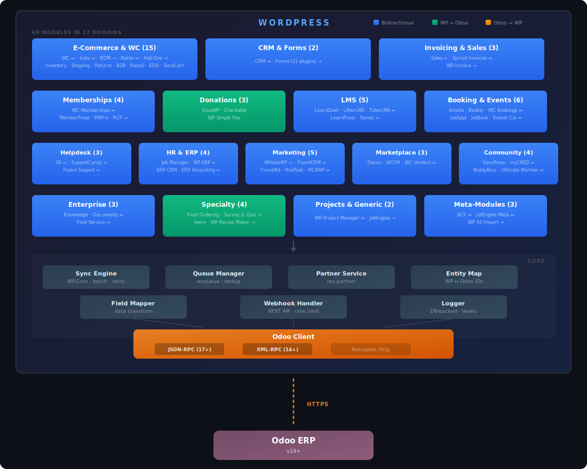

# WP4Odoo — WordPress For Odoo

[](https://github.com/PaulArgoud/wp4odoo/actions/workflows/ci.yml)


Modular WordPress plugin that creates a seamless, bidirectional bridge between WordPress/WooCommerce and Odoo ERP (v14+). Built on a clean, extensible architecture with 72 integration modules, an async sync queue, WordPress Multisite support (per-site company scoping), and full WP-CLI support. Ships in **3 languages** (English, French, Spanish).

**Target users:** WordPress agencies and businesses running Odoo as their ERP who need reliable, real-time data flow between their website and back-office.


## Features

- **Async Queue** — No API calls during user requests; all sync jobs go through a persistent database queue with exponential backoff, deduplication, and configurable batch size
- **Dual Transport** — JSON-RPC 2.0 (default for Odoo 17+) and XML-RPC (legacy), swappable via settings, shared HTTP layer via `Retryable_Http` trait. Retry orchestration at queue level (exponential backoff via `Sync_Engine`)
- **Encrypted Credentials** — API keys encrypted at rest with libsodium (OpenSSL fallback)
- **Webhooks** — REST API endpoints for real-time notifications from Odoo, with per-IP rate limiting
- **Admin Dashboard** — 6-tab settings interface (Connection, Sync, Modules, Queue, Logs, Health) with guided onboarding and system health monitoring
- **WP-CLI** — Full command suite: `wp wp4odoo status|test|sync|queue|module` for headless management
- **WPML / Polylang Translation Sync** — Multilingual product sync via WPML or Polylang: pushes translated names/descriptions to Odoo with language context, pulls translations back to create/update translated posts. Category and attribute value translations included
- **Multisite** — WordPress Multisite support: each site in a network syncs with a specific Odoo company (`res.company`). Shared network connection with per-site company_id mapping. Network admin page for centralized configuration
- **Extensible** — Register custom modules via `wp4odoo_register_modules`; filter data with `wp4odoo_map_to_odoo_*` / `wp4odoo_map_from_odoo_*`; map ACF or JetEngine custom fields to Odoo via meta-modules
- **Multilingual** — 1006 translatable strings, ships with English, French, and Spanish. Translation-ready via `.po`/`.mo`

## Requirements

PHP 8.2+, MySQL 8.0+ / MariaDB 10.5+, WordPress 6.0+, Odoo 17+ (JSON-RPC) or 14+ (XML-RPC).

### Odoo Compatibility

| Versions | On-Premise | Odoo.sh   | Online  | One App Free |
|:---------|:----------:|:---------:|:-------:|:------------:|
| 17 – 19  | ✅ Full³   | ✅ Full³ | ✅ Full | ⚠️ Partial²  |
| 14 – 16  | ✅ Full³   | ✅ Full³ | N/A¹    | N/A¹         |
| < 14     | ❌         | ❌       | N/A¹    | N/A¹         |

> ¹ Odoo Online always runs the latest stable version (currently 17+), so older versions do not apply.
>
> ² **[One App Free](https://www.odoo.com/pricing)** is Odoo's free plan (one app, unlimited users). WP4Odoo modules require multiple Odoo apps (see table below), so only a subset of features will work. Upgrade to the Standard plan for full compatibility.
>
> ³ Works with both Odoo **Community** (free) and **Enterprise** editions — all required apps are included in Community.

- **Odoo 17+** — uses JSON-RPC 2.0 (default, recommended)
- **Odoo 14 – 16** — uses XML-RPC (legacy transport, select in plugin settings)
- **Odoo < 14** — not supported (external API incompatibilities)

All hosting types expose the standard Odoo external API used by the plugin. No custom Odoo modules are required — only the standard apps listed in the module tables below.

## Installation

1. Download or clone this repository into `wp-content/plugins/wp4odoo/`
2. Activate the plugin from the WordPress admin
3. Go to **Odoo Connector** in the admin menu
4. Enter your Odoo credentials (URL, database, username, API key) in the **Connection** tab
5. Click **Test Connection** to verify
6. Enable the modules you need in the **Modules** tab

## Module System

Each Odoo domain is encapsulated in an independent module extending `Module_Base`. The plugin automatically detects missing Odoo apps at connection test and module activation.

**Sync direction:** ↔️ Bidirectional — ➡️ WP to Odoo — ⬅️ Odoo to WP

| WordPress Module                    | Sync | Odoo Apps                             | Free⁴ | Key Features                                                                                                                          |
|-------------------------------------|:----:|---------------------------------------|:-----:|---------------------------------------------------------------------------------------------------------------------------------------|
| **ACF (Advanced Custom Fields)**    |  ↔️  | —                                     |  —   | Maps ACF custom fields ↔ Odoo `x_*` fields via filters, 9 type conversions                                                             |
| **AffiliateWP**                     |  ➡️  | Contacts, Invoicing                   |  ⚠️  | Affiliates → partners (vendors), referrals → vendor bills (`in_invoice`), auto-post on pay                                             |
| **Amelia Booking**                  |  ↔️  | Contacts, Calendar                    |  ⚠️  | Service sync (bidirectional), appointment sync (push), customer-to-partner                                                             |
| **Awesome Support**                 |  ↔️  | Contacts, Helpdesk (+ Project)        |  ⚠️  | Ticket/status sync, dual-model (helpdesk.ticket or project.task), stage heuristic                                                      |
| **Bookly Booking**                  |  ↔️  | Contacts, Calendar                    |  ⚠️  | Service sync (bidirectional), booking sync (push) via WP-Cron, hash detection                                                          |
| **BuddyBoss / BuddyPress**          |  ↔️  | Contacts                              |  ❌  | Profile ↔ res.partner (xprofile enrichment), groups → res.partner.category, M2M tags                                                   |
| **CRM**                             |  ↔️  | Contacts, CRM                         |  ⚠️  | Contact sync, lead form shortcode, email dedup, archive-on-delete                                                                      |
| **Documents (WP Doc Revisions + WPDM)** |  ↔️  | Documents (Enterprise)            |  ❌  | Document ↔ documents.document (base64, SHA-256 change detection), folder ↔ documents.folder (hierarchy)                                |
| **Dokan**                           |  ↔️  | Contacts, Purchase, Invoicing         |  ❌  | Vendor ↔ res.partner (supplier), sub-orders → purchase.order, commissions → vendor bills, withdrawals → payments. Requires WooCommerce |
| **Easy Digital Downloads**          |  ↔️  | Contacts, Sales, Invoicing            |  ❌  | Download/order sync, status mapping, invoice pull                                                                                      |
| **Ecwid**                           |  ➡️  | Contacts, Sales                       |  ❌  | Product/order sync via WP-Cron polling, REST API, hash-based detection                                                                 |
| **Events Calendar**                 |  ↔️  | Contacts, Events (+ Calendar)         |  ⚠️  | Event/ticket/attendee sync, dual-model (event.event or calendar.event), exclusive group: events                                        |
| **FluentBooking**                   |  ↔️  | Contacts, Calendar                    |  ⚠️  | Service sync (bidirectional), booking sync (push), custom DB tables, Booking_Module_Base pattern                                       |
| **FluentCRM**                       |  ↔️  | Contacts, Email Marketing             |  ⚠️  | Subscriber/list/tag sync, bidirectional subscribers+lists, push-only tags, custom DB tables                                            |
| **Field Service**                   |  ↔️  | Field Service (Enterprise)            |  ❌  | CPT ↔ field_service.task, status mapping, planned date/deadline/priority, dedup by name                                                |
| **FluentSupport**                   |  ↔️  | Contacts, Helpdesk (+ Project)        |  ⚠️  | Ticket sync, dual-model (helpdesk.ticket or project.task), configurable team/project ID                                                |
| **FooEvents for WooCommerce**       |  ↔️  | Contacts, Events (+ Calendar)         |  ⚠️  | Event product/attendee sync, dual-model (event.event or calendar.event), requires WooCommerce                                          |
| **Food Ordering (GloriaFood + WPPizza + RestroPress)** |  ➡️  | POS Restaurant              |  ❌  | Food orders → pos.order with line items, per-plugin extraction, partner resolution                                                     |
| **Forms (11 plugins)**              |  ➡️  | Contacts, CRM                         |  ⚠️  | GF, WPForms, CF7, Fluent, Formidable, Ninja, Forminator, JetFormBuilder, Elementor Pro, Divi, Bricks — lead auto-detection             |
| **FunnelKit (ex-WooFunnels)**       |  ↔️  | Contacts, CRM                         |  ⚠️  | Contacts → crm.lead (bidi), funnel steps → crm.stage (push), pipeline stage mapping                                                    |
| **GamiPress**                       |  ↔️  | Contacts, Loyalty                     |  ❌  | Points → loyalty.card (find-or-create), achievements/ranks → product.template                                                          |
| **Jeero Configurator**              |  ➡️  | Contacts, Manufacturing               |  ❌  | Configurable products → mrp.bom with bom_line_ids, cross-module WC product resolution. Requires WooCommerce                            |
| **JetAppointments (Crocoblock)**    |  ↔️  | Contacts, Calendar                    |  ⚠️  | Service sync (bidirectional), appointment sync (push), CPT-based data access                                                           |
| **JetBooking (Crocoblock)**         |  ↔️  | Contacts, Calendar                    |  ⚠️  | Service sync (bidirectional), booking sync (push), hybrid: CPT services + custom table bookings                                        |
| **JetEngine (Crocoblock)**          |  ➡️  | (configurable)                        |  —   | Generic CPT → Odoo mapping, dynamic entity types from admin settings, 4 field sources, 8 type conversions                              |
| **JetEngine Meta (Crocoblock)**     |  ↔️  | —                                     |  —   | Maps JetEngine meta-fields ↔ Odoo fields via filters (pattern identical to ACF), enriches other modules                                |
| **GiveWP**                          |  ➡️  | Contacts, Invoicing (+ OCA Donation)  |  ⚠️  | Form/donation sync, dual-model detection, auto-validate, recurring donations                                                           |
| **Knowledge**                       |  ↔️  | Knowledge (Odoo Enterprise)           |  ❌  | WordPress posts ↔ knowledge.article, HTML body, parent hierarchy, category filter, translation support                                 |
| **LearnDash**                       |  ↔️  | Contacts, Sales, Invoicing            |  ❌  | Course/group/transaction/enrollment sync, auto-post invoices, course/group pull                                                        |
| **LearnPress**                      |  ↔️  | Contacts, Sales, Invoicing            |  ❌  | Course/order/enrollment sync, auto-post invoices, course pull, LMS_Module_Base pattern                                                 |
| **LifterLMS**                       |  ↔️  | Contacts, Sales, Invoicing            |  ❌  | Course/membership/order/enrollment sync, auto-post invoices, course/membership pull                                                    |
| **Mailchimp for WP (MC4WP)**        |  ↔️  | Contacts, Email Marketing             |  ⚠️  | Subscriber ↔ mailing.contact, list ↔ mailing.list, M2M list assignment, email dedup                                                    |
| **MailPoet**                        |  ↔️  | Contacts, Email Marketing             |  ⚠️  | Subscriber ↔ mailing.contact, list ↔ mailing.list, M2M list assignment, name split, email dedup                                        |
| **myCRED**                          |  ↔️  | Contacts, Loyalty                     |  ❌  | Points → loyalty.card (find-or-create), badges → product.template, anti-loop guard                                                     |
| **MemberPress**                     |  ➡️  | Contacts, Members, Invoicing          |  ❌  | Plan/txn/sub sync, auto-post invoices, status mapping                                                                                  |
| **Modern Events Calendar (MEC)**    |  ↔️  | Contacts, Events (+ Calendar)         |  ⚠️  | Event/booking sync, dual-model (event.event or calendar.event), exclusive group: events, MEC Pro bookings                              |
| **Paid Memberships Pro**            |  ➡️  | Contacts, Members, Invoicing          |  ❌  | Level/order/membership sync, auto-post invoices, status mapping                                                                        |
| **Restrict Content Pro**            |  ➡️  | Contacts, Members, Invoicing          |  ❌  | Level/payment/membership sync, auto-post invoices, status mapping                                                                      |
| **Sales**                           |  ⬅️  | Contacts, Sales, Invoicing            |  ❌  | Order/invoice CPTs, customer portal shortcode, currency display                                                                        |
| **Sensei LMS**                      |  ↔️  | Contacts, Sales, Invoicing            |  ❌  | Course/order/enrollment sync, auto-post invoices, bidirectional course pull, LMS_Module_Base pattern                                   |
| **ShopWP**                          |  ➡️  | Products                              |  ❌  | Shopify product sync via CPT + custom table, variant price/SKU                                                                         |
| **Sprout Invoices**                 |  ↔️  | Contacts, Invoicing                   |  ⚠️  | Invoice/payment sync, status mapping, auto-posting, One2many line items, pull                                                          |
| **SureCart**                        |  ↔️  | Contacts, Sales, Subscriptions        |  ❌  | Product ↔ product.template, order ↔ sale.order, subscription → sale.subscription. Alternative to WooCommerce                           |
| **SupportCandy**                    |  ↔️  | Contacts, Helpdesk (+ Project)        |  ⚠️  | Ticket/status sync, dual-model, custom table data access, stage heuristic                                                              |
| **Survey & Quiz (Ays + QSM)**       |  ➡️  | Survey                                |  ❌  | Quizzes → survey.survey with questions, responses → survey.user_input with answers, scoring data                                       |
| **TutorLMS**                        |  ↔️  | Contacts, Sales, Invoicing            |  ❌  | Course/order/enrollment sync, auto-post invoices, bidirectional course pull                                                            |
| **Ultimate Member**                 |  ↔️  | Contacts                              |  ❌  | Profile ↔ res.partner, roles → res.partner.category, custom field enrichment, archive-on-delete                                        |
| **WC B2B / Wholesale Suite**        |  ➡️  | Contacts, Sales, Invoicing            |  ❌  | Company accounts → res.partner (is_company), wholesale pricing → pricelist rules, payment terms, wholesale roles → product.pricelist. Requires WooCommerce |
| **WC Bookings**                     |  ↔️  | Contacts, Calendar                    |  ⚠️  | Booking product/booking sync, all-day support, persons count, status filter                                                            |
| **WC Points & Rewards**             |  ↔️  | Contacts, Loyalty                     |  ❌  | Point balance sync via loyalty.card, find-or-create by partner+program                                                                 |
| **WC Product Add-Ons**              |  ➡️  | Contacts, Sales (+ Manufacturing)     |  ❌  | Multi-plugin (official + ThemeHigh + PPOM), dual mode: attributes or BOM components. Requires WooCommerce                              |
| **WC Rental**                       |  ➡️  | Contacts, Sales                       |  ❌  | Rental orders → sale.order with Odoo Rental fields, configurable meta keys, requires WooCommerce                                       |
| **WC Returns**                      |  ↔️  | Contacts, Invoicing, Inventory        |  ❌  | WC refund ↔ Odoo credit note, return picking push, line-item detail, YITH/ReturnGO hooks. Requires WooCommerce                         |
| **WC Inventory**                    |  ↔️  | Inventory                             |  ❌  | Multi-warehouse stock sync, stock.move movements, location pull, ATUM multi-inventory support. Requires WooCommerce                    |
| **WC Product Bundles & Composites** |  ➡️  | Contacts, Manufacturing               |  ❌  | Product bundle/composite sync as manufacturing BOMs (mrp.bom), phantom/normal type                                                     |
| **WC Vendors**                      |  ↔️  | Contacts, Purchase, Invoicing         |  ❌  | Vendor ↔ res.partner (supplier), sub-orders → purchase.order, commissions → vendor bills, payouts → payments. Requires WooCommerce     |
| **WCFM Marketplace**                |  ↔️  | Contacts, Purchase, Invoicing         |  ❌  | Vendor ↔ res.partner (supplier), sub-orders → purchase.order, commissions → vendor bills, withdrawals → payments. Requires WooCommerce |
| **WC Shipping**                     |  ↔️  | Inventory, Delivery                   |  ❌  | Bidirectional shipment tracking, carrier sync, ShipStation/Sendcloud/Packlink/AST provider hooks. Requires WooCommerce                 |
| **WooCommerce**                     |  ↔️  | Contacts, Sales, Inventory, Invoicing |  ❌  | Product/order/stock/category sync, variants, image + gallery, tax + shipping mapping, exchange rates, bulk ops                         |
| **WooCommerce Memberships**         |  ↔️  | Contacts, Members                     |  ❌  | Plan sync (bidirectional), membership status/date pull, reverse status mapping                                                         |
| **WooCommerce Subscriptions**       |  ↔️  | Contacts, Subscriptions, Invoicing    |  ❌  | Subscription/renewal sync, dual-model (sale.subscription / account.move)                                                               |
| **WP All Import**                   |  ➡️  | —                                     |  —   | Intercepts CSV/XML imports, routes to sync queue (18 post types), filterable                                                           |
| **WP Charitable**                   |  ➡️  | Contacts, Invoicing (+ OCA Donation)  |  ⚠️  | Campaign/donation sync, dual-model detection, auto-validate, recurring                                                                 |
| **WP Crowdfunding**                 |  ➡️  | Products                              |  ❌  | Campaign sync as service products, funding description, coexists with WC                                                               |
| **WP ERP**                          |  ↔️  | Contacts, HR                          |  ❌  | Employee/department/leave sync, dependency chain, leave status mapping, custom DB tables                                               |
| **WP ERP CRM**                      |  ↔️  | Contacts, CRM                         |  ⚠️  | Contact → crm.lead (bidi), activity → mail.activity (push), life stage mapping, cross-module partner linking                           |
| **WP ERP Accounting**               |  ↔️  | Invoicing, Accounting                 |  ❌  | Journal entries ↔ account.move, chart of accounts ↔ account.account, journals ↔ account.journal, custom DB tables                      |
| **WP Job Manager**                  |  ↔️  | HR Recruitment                        |  ✅  | Job listings ↔ hr.job, status mapping (publish ↔ recruit), department pull                                                             |
| **WP Project Manager (weDevs)**     |  ↔️  | Contacts, Project                     |  ❌  | Projects ↔ project.project, tasks ↔ project.task, timesheets → account.analytic.line, employee resolution                              |
| **WP Recipe Maker**                 |  ➡️  | Products                              |  ❌  | Recipe sync as service products, structured descriptions                                                                               |
| **WP Simple Pay**                   |  ➡️  | Contacts, Invoicing (+ OCA Donation)  |  ⚠️  | Stripe payment sync, webhook capture, dual-model, auto-validate, recurring                                                             |
| **WP-Invoice**                      |  ➡️  | Contacts, Invoicing                   |  ⚠️  | Invoice sync, auto-posting for paid invoices, One2many line items                                                                      |

> ⁴ **[One App Free](https://www.odoo.com/pricing)**: with CRM as your free app, CRM, WP ERP CRM, and Forms modules work. With Email Marketing as your free app, FluentCRM, MailPoet, and Mailchimp for WP work. With Invoicing as your free app, GiveWP, WP Charitable, WP Simple Pay, Sprout Invoices, and WP-Invoice work. With Calendar as your free app, Amelia, Bookly, FluentBooking, JetAppointments, JetBooking, WC Bookings, Events Calendar (fallback mode), MEC (fallback mode), and FooEvents (fallback mode) work (partial — no Contacts). With Helpdesk as your free app, Awesome Support, SupportCandy, and Fluent Support work (partial — no Contacts). Sales, WooCommerce, WooCommerce Subscriptions (Enterprise), WC Inventory, WC Product Bundles & Composites, WC Points & Rewards, WC Rental, WC Returns, WC Shipping, Memberships (MemberPress/PMPro/RCP/WC Memberships), LMS (LearnDash/LifterLMS/TutorLMS/LearnPress/Sensei), GamiPress, myCRED, BuddyBoss, Ultimate Member, Ecwid, SureCart, WC B2B, Marketplace (Dokan/WCFM/WC Vendors), WP ERP, WP ERP Accounting, WP Project Manager, Knowledge (Enterprise), Documents (Enterprise), Field Service (Enterprise), Food Ordering, Jeero Configurator, and WP Recipe Maker require 2–4 apps. Survey & Quiz requires the Survey app. JetEngine, JetEngine Meta, and WC Product Add-Ons depend on the target Odoo models configured.

## Usage

### Shortcodes

| Shortcode                   | Description                                                                                       |
|-----------------------------|---------------------------------------------------------------------------------------------------|
| `[wp4odoo_customer_portal]` | Customer portal with Orders and Invoices tabs (requires logged-in user linked to an Odoo partner) |
| `[wp4odoo_lead_form]`       | Lead capture form with AJAX submission, creates `crm.lead` in Odoo                                |

### WP-CLI

```bash
wp wp4odoo status                    # Connection info, queue stats, modules
wp wp4odoo test                      # Test Odoo connection
wp wp4odoo sync run                  # Process sync queue
wp wp4odoo sync run --dry-run        # Preview sync without changes
wp wp4odoo sync run --blog_id=3      # Process queue for a specific site (multisite)
wp wp4odoo queue stats               # Queue statistics
wp wp4odoo queue list --page=1       # Paginated job list
wp wp4odoo queue retry               # Retry all failed jobs
wp wp4odoo queue cleanup --days=7    # Delete old completed/failed jobs
wp wp4odoo queue cancel 42           # Cancel a pending job
wp wp4odoo cleanup orphans           # Remove orphaned entity map entries
wp wp4odoo cleanup orphans --dry-run # Preview orphans without deleting
wp wp4odoo cache flush               # Flush Odoo schema cache
wp wp4odoo module list               # List modules with status
wp wp4odoo module enable crm         # Enable a module
wp wp4odoo module disable crm        # Disable a module
```

### REST API & Hooks

The plugin exposes 4 REST endpoints under `wp-json/wp4odoo/v1/` (webhook receiver, webhook health check, system health, manual sync trigger) and 14 action hooks + 68 data filters for customization.

## Architecture



All synchronization goes through a persistent database queue — no Odoo API calls are made during user requests:

1. A WordPress or Odoo event triggers a sync job
2. The job is enqueued in `wp4odoo_sync_queue`
3. A WP-Cron task processes the queue in configurable batches
4. Data is transformed via `Field_Mapper` and sent through `Odoo_Client`
5. Entity mappings are stored in `wp4odoo_entity_map` with sync hashes for change detection

### Security

- API keys encrypted at rest (libsodium with OpenSSL fallback)
- Admin AJAX handlers protected by nonce + `manage_options` capability
- Webhooks authenticated via `X-Odoo-Token` header + per-IP rate limiting (20 req/min)
- All inputs sanitized (`sanitize_text_field`, `esc_url_raw`, `absint`)
- `index.php` in every subdirectory to prevent directory listing

## Development

```bash
composer install
composer check          # Runs PHPCS + PHPUnit + PHPStan (mirrors CI)
```

Integration tests require Docker.

- 📖 [ARCHITECTURE.md](ARCHITECTURE.md) — Class diagrams, data flows, REST API endpoints, hooks & filters reference
- 📝 [CHANGELOG.md](CHANGELOG.md) — Version history
- 📋 [CONTRIBUTING.md](CONTRIBUTING.md) — Development setup, coding standards, testing, translations, commit conventions, PR checklist

## Support the Project

WP4Odoo is free and open source. If it saves you time or money, consider throwing a few bucks my way — it keeps the lights on and the commits flowing.

[](https://github.com/sponsors/PaulArgoud)
[](https://mempool.space/address/bc1qyytnc6xzhfgem7anh939aqmq6n5zzyshawwr0m)
[](https://paypal.me/paulargoud)

## License

[GPL v2 or later](LICENSE)